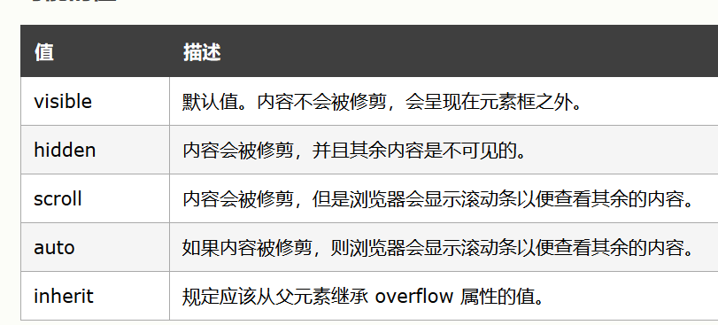
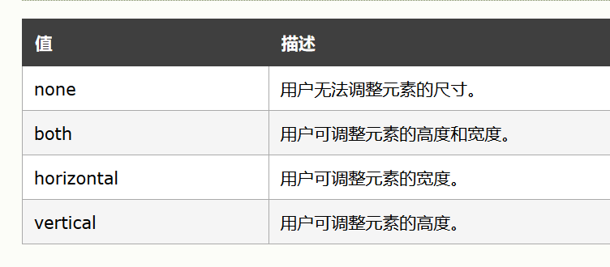

# ie6 混杂模式的盒子
- 与原来盒子的唯一区别是计算方式不同
ie6 混杂模式下的 width 就是盒子真实的宽度   
- 标准模式下盒子真实的宽度 是 width + padding + border
## ie6 混杂模式盒模型的触发
```css
div{
    box-sizing:border-box;
}
```
## 应用场景

1. 描述 : 两个子级容器占据父级容器(父级容器的宽度不固定)的 50 %，且要给其中的一个盒子添加border 或者 padding ，不能够使子容器换行

[**点击查看应用场景 一**](http://www.msse.vip/Accumulation/CSS/border_boxApply1.html)
```html
<div class="wrapper">
        <div class="content"></div>
        <div class="content"></div>
</div>
```
```css
        *{
          margin:0;
          padding:0;  
        }
        .wrapper{
            width:100%;
            height: 300px;
            border:1px solid black;
        }
        .content{
            float: left;
            width:50%;
            height: 100px;
            background: aquamarine;

        }
        .content:first-of-type{
            background: orange;
            border:10px solid blue;
            box-sizing: border-box;
        }
```
2. 描述 ： input 输入框的宽度

[**点击查看**]()

## 相关属性
### overflow 
> overflow 属性规定当内容溢出元素框时发生的事情,定义溢出元素内容区的内容会如何处理。它是 overflow-x 和overflow-y的 简写属性 。




> 要注意的是，  设置一个轴(比如overflow-x)为visible（默认值），同时设置另一个轴为不同的值，会导致设置visible的轴(比如 ： overflow-y)的行为会变成auto。 

具体的结构应用
```html
<style>
        .wrapper{
            width:100px;
            height: 200px;
            border:1px solid black;
            overflow-x: scroll;
            overflow-y: hidden;
        }
        .content{
            width:150px;
            height: 250px;
        }
</style>


<div class="wrapper">
    <div class="content">
        在这里输入文本内容
    </div>
</div>
```
### resize
> resize 属性规定是否可由用户调整元素的尺寸。     
注释：如果希望此属性生效，需要设置元素的 overflow 属性，值可以是 auto、hidden 或 scroll。

