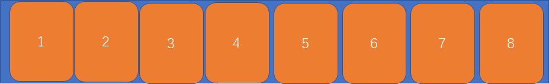

# 1. 设置为弹性盒子、
> 设置 父级 的 display:flex/inlint-flex;
 
默认规定父级叫做盒子，子级叫做项目
# 2. 外部盒子(父级)能设置的属性
```
flex-direction
flex-wrap
flex-flow
justify-content
align-items
align-content
```
## 2.1 flex-direction
> flex-direction属性决定主轴的方向（即项目的排列方向）。
```
flex-direction: row | row-reverse | column | olumn-reverse;
```
```
row（默认值）：主轴为水平方向，起点在左端。
row-reverse：主轴为水平方向，起点在右端。
column：主轴为垂直方向，起点在上沿。
column-reverse：主轴为垂直方向，起点在下沿。
```
 


## 2.2 flex-wrap
> 默认情况下，项目都排在一条线（又称"轴线"）上,不会进行换行，项目会进行伸缩。flex-wrap属性定义，如果一条轴线排不下，如何换行。
```
 flex-wrap: nowrap(默认值) | wrap | wrap-reverse;
```
 - nowrap:不换行
 
 - wrap:换行，第一行在上方
 
 - wrap-reverse：换行，第一行在下方。


## 2.3 flex-flow
> flex-flow属性是flex-direction属性和flex-wrap属性的简写形式，默认值为row nowrap。
## 2.4 justify-content
> justify-content属性定义了项目在主轴上的对齐方式。
```
justify-content: flex-start | flex-end | center | space-between | space-around;
```
flex-start（默认值）：左对齐   


flex-end：右对齐    

center： 居中   

单行元素的居中：

 


多行元素的居中：
主轴多行元素居中
 
space-between：两端对齐，项目之间的间隔都相等。  


space-around：每个项目两侧的间隔相等。所以，项目之间的间隔比项目与边框的间隔大一倍。


## 2.5 align-items
> align-items属性定义项目在交叉轴上如何对齐。(主要还是针对单行元素来处理交叉轴对齐方式的，因为还有一个 align-content 属性是专门用来处理多行元素的对齐方式的，单行元素不好使 )
```
 align-items: flex-start | flex-end | center | baseline | stretch;
```

- flex-start：交叉轴的起点对齐。
- flex-end：交叉轴的终点对齐。
- center：交叉轴的中点对齐。(要注意多行元素的居中形式，如下图：)

--------上面三个值的和主轴的一样-----------------------------
- baseline: 项目的第一行文字的基线对齐。

- stretch（默认值）：如果项目未设置高度或设为auto，将占满整个容器的高度。
## 2.6 align-content
> align-content属性定义了多根轴线(即多行元素)的对齐方式。如果项目只有一根轴线(即只有一行元素)，该属性不起作用。
```
align-content: flex-start | flex-end | center | space-between | space-around | stretch;
```


- flex-start：与交叉轴的起点对齐。
- flex-end：与交叉轴的终点对齐。
- center：与交叉轴的中点对齐。

- space-between：与交叉轴两端对齐，轴线之间的间隔平均分布。
- space-around：每根轴线两侧的间隔都相等。所以，轴线之间的间隔比轴线与边框的间隔大一倍。
- stretch（默认值）：轴线占满整个交叉轴。


# 3. 内部盒子(子级)能设置的属性
```
order
flex-grow
flex-shrink
flex-basis
flex
align-self
```
# 3.1 order
>order属性定义项目的排列顺序。数值越小，排列越靠前，默认为0，可填负数。
# 3.2 flex-grow
>flex-grow属性定义项目的放大比例，默认为0，即如果存在剩余空间，也不放大。

当主轴方向还有剩余空间，flex-grow 会根据比例来瓜分盒子剩余的空间。
```css
/* 如果剩余300px，那么content1 瓜分100px,content2瓜分200px */
.content1{
    flex-grow:1;
}
.content2{
    flex-grow:2;
}
```

# 3.3  flex-shrink
flex-shrink属性定义了项目的缩小比例，默认为1，即如果空间不足，该项目将缩小。

一旦项目超过主轴方向的宽度，就会进行收缩，收缩比例的计算如下：
- 当项目宽度相同时，可以按照各自的比例进行伸缩计算
- 当项目的宽度不同时，计算公式为：
```css
.content1,.content2{
    width:200px;
    flex-shrink:1;
}
.content3{
    width:400px;
    flex-shrink:3;
}

/* 200px * 1 + 200px * 1 + 400px * 3  = 1600px*/
/* 200px * 1/1600px   *   多出来的部分 */
/* 要注意这里的200px 是 内容区宽度 (width)，而不是盒子的真实宽度,无论是标准盒模型还是IE6混杂模式的盒子 */
```

# 3.4 flex-basis
flex-basis属性定义了在分配多余空间之前，项目占据的主轴空间（main size）。浏览器根据这个属性，计算主轴是否有多余空间。它的默认值为auto，即项目的本来大小。权重比width高。

- 当没有设置width的时候，但是设置了flex-basis的时候或者flex-basis大于width时，代表元素的最小宽度
- 当同时设置了width和flex-basis时，width是宽度的最大值
- 被内容(比如英文字母)撑开的元素不参与压缩


# 3.5 flex
flex属性是flex-grow, flex-shrink 和 flex-basis的简写，默认值为0 1 auto。后两个属性可选。

flex:1      1  1  0%    
flex:auto   1  1  auto
flex:none   0  0  auto
flex:0 auto 0  1  auto
flex:initial0  1  auto

# 3.6 align-self
align-self 属性允许单个项目有与其他项目在交叉轴上有不一样的对齐方式，可覆盖align-items属性，不能覆盖align-content。默认值为auto，表示继承父元素的align-items属性，如果没有父元素，则等同于stretch。
# 4. flex 布局案例

## 4.1 单行元素居中
```html
<div class="wrapper">
        <div class="content">1</div>
        <div class="content">2</div>
        <div class="content">3</div>
</div>

<style>
        .wrapper {
            width: 500px;
            height: 300px;
            border:1px solid black;
            display: flex;
            /* 主轴进行居中对齐 */
            justify-content: center;
            /* 交叉轴进行居中对齐 */
            align-items: center;
        }
        .content{
            width:100px;
            height: 100px;
            border:1px solid orange;
        }
</style>
```
## 4.2 多行元素居中
```html
<div class="wrapper">
        <div class="content">1</div>
        <div class="content">2</div>
        <div class="content">3</div>
        <div class="content">1</div>
        <div class="content">2</div>
        <div class="content">3</div>
    
</div>

<style>
        .wrapper {
            width: 500px;
            height: 300px;
            border:1px solid black;
            display: flex;
            /* 主轴进行居中对齐 */
            justify-content: center;
            /* 交叉轴进行居中对齐 */
            align-content: center;
        }
        .content{
            width:100px;
            height: 100px;
            border:1px solid orange;
        }
</style>
```
## 4.3 可动态增加的导航栏
```html
<!-- 只需要更改html结构就ok了  -->
<div class="wrapper">
        <div class="content">京东</div>
        <div class="content">淘宝</div>
        <div class="content">苏宁</div>
        <div class="content">网易</div>
</div>

<style>
       .wrapper{
           width:300px;
           height: 200px;
           border:1px solid black;
           display: flex;
       }
       .content{
           /* 不设置宽度也可以进行等比例扩张 */
           flex:1 1 auto;
           text-align: center;
           height: 25px;
           background-color: orange;
           margin: 0 1px;
       }
       .content:hover{
           background-color: orangered;
           color:#fff;
       }
</style>
```

## 4.4 圣杯模式布局

```html
    <div class="wrapper">
        <div class="header"></div>
        <div class="content">
            <div class="left"></div>
            <div class="center"></div>
            <div class="right"></div>
            
        </div>
        <div class="footer"></div>
    </div>
    <style>
            .wrapper{
            width:500px;
            height: 500px;
            border:1px solid black;
            display:flex;
            flex-direction: column;
        }
        .header,.footer,.left,.right{
            flex: 0 0 20%;
            border:1px solid orange;
            box-sizing: border-box;
        }
        .content{
            flex:1 1 auto;
            display: flex;
        }
        .center{
            flex:1 1 auto;
        }
        
    </style>
```

# 5. 总结

## 5.1 盒子
justify-content  处理主轴对齐方式；    
align-items  主要是处理交叉轴单行元素对齐方式,如果是多行元素则行与行之间会有一定的空隙
align-content 处理多行元素对齐方式，行与行之间的元素是紧挨着的

- 就算不设置宽度，弹性盒子也可以进行瓜分