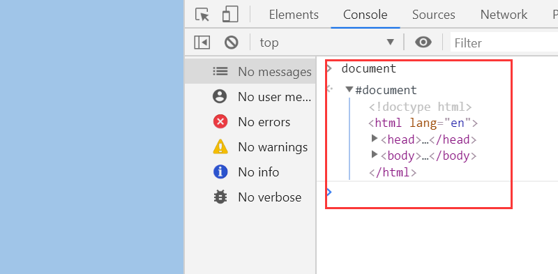

# 1.什么是dom(Document Object Modal)
操作html的一个接口集合
# 2.DOM基本操作
## 2.0 document代表整个对象
代表整个文档的现实形式
如果说给html标签上面再套上一个标签，那这个标签就是document。html只是文档(documetn)里面的根标签

## 2.1 查
### 2.1.1 document.getElementById( )
ie8一下浏览器，不区分id大小写，并能将name选出来
### 2.1.2 document.getElementsByTagName( )
选择出来的结果为一个类数组（既可以当对象,又可以当数组）

里面可以写*，即document.getElenmentByTagName('*');

选择所有标签

没有兼容性问题
### 2.1.3 document.getElementsByClassName( )
ie8及以下版本没有此方法

### 2.1.4 document.getElementsByName( )
选出一组（除了id和querySelector以外，选出的都是成组的）
name属性并不是在所有标签都好使，一般只在form,img,iframe好使，但现在应该都好使了

### 2.1.5 document.querySelector( )
css里怎么写，这里就怎么写   ,选择出来是一个
document.querySelector( 'div > span' )
选择出来的元素不是实时的，相当于选择出来一个副本（复制品）

### 2.1.6 querySelectorAll( )
和上面那个一样，不过选择出来是一组元素
## 注意
一般不用id写选择器，比如在selection写父子选择器的时候，与后端交互后端可能会把id换掉，以换取相应的样式；
## 2.2 遍历dom节点树(非方法)
所有浏览器都好使
### 2.2.1 parentNode
一切元素都有这个属性，比如:oSpan.parentNode
选出其父级元素（一个元素只有一个父级），html.parent===>document
### 2.2.2 childNodes
是直接子级，不包括孙子级别
选取所有子节点（包括文本节点和元素节点、注释节点、）
### 2.2.3 firstChild/lastChild
第一个子节点，最后一个子节点
### 2.2.4 nextSibling/previousSibling
后一个兄弟节点，前一个兄弟节点
## 2.3 遍历元素节点数
没有文本节点
### 2.3.1 parentElement
父级元素节点    
html的父级元素节点为null
### 2.3.2 children
元素子节点(不包括注释节点，文本节点)
### 2.3.3 firstElementChild/lastElementChild
### 2.3.4 nextElementSibling/previousElementSibling
## 2.4 节点的四个属性
### 2.4.1 nodeName
元素的标签名，大写（document和文本节点除外），只读
document -->#document
div      -->DIV
text     -->#text
### 2.4.2 nodeValue
只有文本节点和注释节点才有，可读可写
### 2.4.3 nodeType
该节点类型
元素节点 - 1
属性节点 - 2
文本节点 - 3
注释节点 - 8
document - 9
DocumentFragment - 11
### 2.4.4 attributes
所有的属性节点
div.getAttribute()
div.setAttribute()
### 2.4.5 hasChildNodes()
有没有子节点，包括注释节点和文本节点
# 3. DOM结构树
