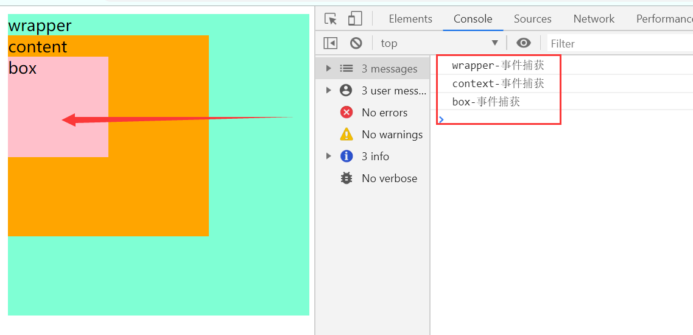
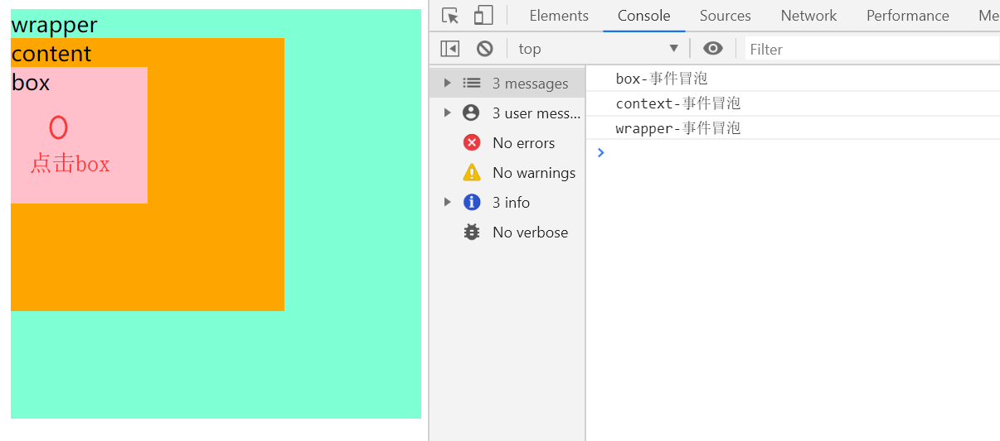
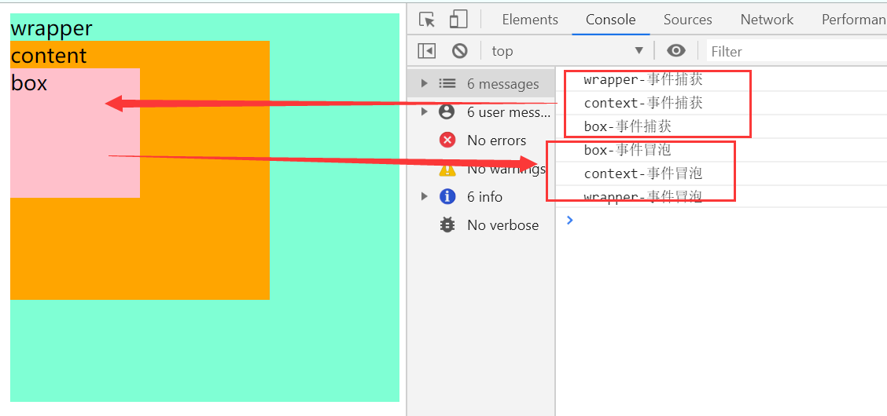
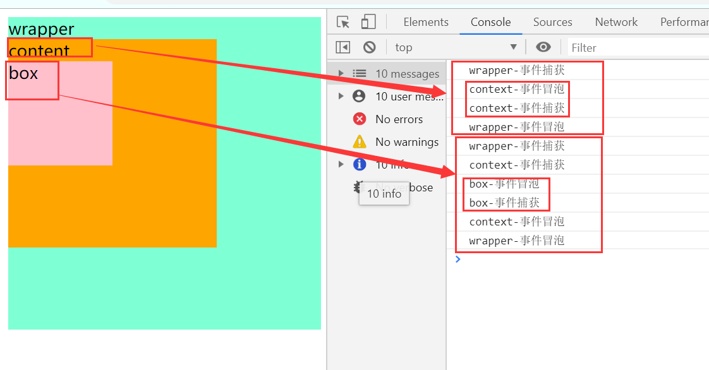

# 事件委托
## html代码
```html
    <div class="wrapper">wrapper
        <div class="content">content
            <div class="box">box</div>
        </div>
    </div>
```
## JavaScript代码
```javascript
var oWrapper = document.getElementsByClassName('wrapper')[0];
var oContext = document.getElementsByClassName('content')[0];
var oBox = document.getElementsByClassName('box')[0];


```
## 事件触发的机制是先捕获，再冒泡
- 捕获(点击box时，从外往里依次触发)
```javascript
```


```javascript
oWrapper.addEventListener('click',function(){
    console.log('wrapper-事件捕获')
},true)
oContext.addEventListener('click',function(){
    console.log('context-事件捕获')
},true)
oBox.addEventListener('click',function(){
    console.log('box-事件捕获')
},true)
```
- 冒泡(点击box时，从里往外，依次触发)
```javascript
oWrapper.addEventListener('click',function(){
    console.log('wrapper-事件冒泡')
},false)
oContext.addEventListener('click',function(){
    console.log('context-事件冒泡')
},false)
oBox.addEventListener('click',function(){
    console.log('box-事件冒泡')
},false)
```


- 当同时有事件冒泡和事件捕获时，先捕获，再冒泡(特例请看下一条)
```javascript
oWrapper.addEventListener('click',function(){
    console.log('wrapper-事件捕获')
},true)
oWrapper.addEventListener('click',function(){
    console.log('wrapper-事件冒泡')
},false)
oContext.addEventListener('click',function(){
    console.log('context-事件捕获')
},true)
oContext.addEventListener('click',function(){
    console.log('context-事件冒泡')
},false)
oBox.addEventListener('click',function(){
    console.log('box-事件捕获')
},true)
oBox.addEventListener('click',function(){
    console.log('box-事件冒泡')
},false)
```

- 当**被点击的元素**同时注册了冒泡和捕获的时候，会依照注册的顺序触发,其他仍然按照先捕获再冒泡的顺序触发
```javascript
oWrapper.addEventListener('click',function(){
    console.log('wrapper-事件冒泡')
},false)
oWrapper.addEventListener('click',function(){
    console.log('wrapper-事件捕获')
},true)

oContext.addEventListener('click',function(){
    console.log('context-事件冒泡')
},false)
oContext.addEventListener('click',function(){
    console.log('context-事件捕获')
},true)

oBox.addEventListener('click',function(){
    console.log('box-事件冒泡')
},false)
oBox.addEventListener('click',function(){
    console.log('box-事件捕获')
},true)
```
