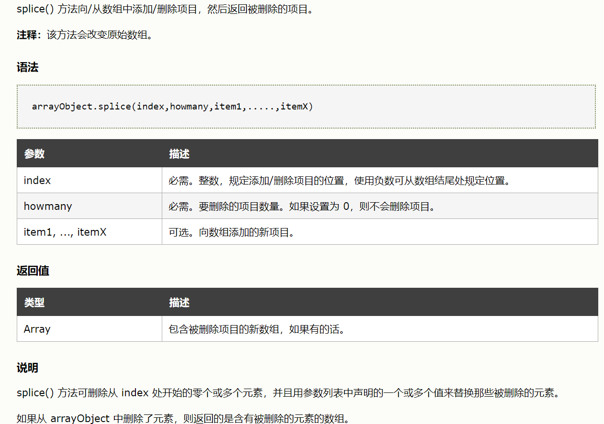

# splice 方法


splice 方法就是把一个数组的哪一部分截取了。

```javascript
var arr = [0,1,2,3,4,5];
var temp1 = arr.splice(1,3);
console.log(arr);
```
上述代码的意思是：把数组 arr 的 [1,3] 索引位(闭区间)的数组截掉，返回值 temp 为截掉的数组 [1,2,3],原数组变为：[0,4,5]

第三个参数选填，如果填上了，就代表把截掉部分的数组替换为什么，比如：

```javascript
var arr = [0,1,2,3,4,5];
var temp1 = arr.splice(1,3，999);
console.log(arr);
```
若没有第三个参数，则arr 为[0,4,5],当有第三个参数的时候，此时的 arr 就是 [0,999,4,5],

利用此性质，可以往数组的某索引位添加元素，比如：
```javascript
var arr = [1,2,3,5];
arr.splice(3,0,4);
console.log(arr)
```
上述代码的意思为：arr[3] = 4.
原本arr[3] = 5,现在将其后移，变为 arr[3] = 4,arr[4] = 5;
arr 变为：[1,2,3,4,5];

当然，如果插入多个元素，则以此将数组位向后移动。比如：
```javascript
var arr = [1,2,3,5];
arr.splice(3,0,4，4);
console.log(arr)
```

arr 变为：[1,2,3,4,4,5];

# includes 方法

查找某个元素是否在数组当中，返回布尔值。
传参形式有两种:
arr.includes(params);   
这一种的意思就是从数组的index索引位开始查找，是否存在params这个元素
arr.includes(params,index);

```javascript
var arr = [1,2,3,4,5];
var bool = arr.includes(2,1);
console.log(bool)
// true


var x = [1,2]
var arr = [1,2,3,4,x];
var bool = arr.includes(x);
console.log(bool)
// true


var arr = [1,2,3,4,[1,2]];
var bool = arr.includes([1,2]);
console.log(bool)
// false
```