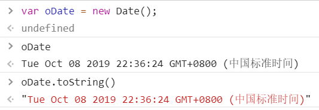
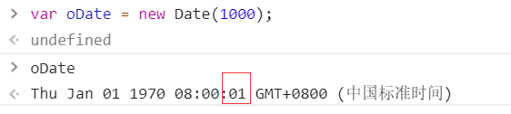
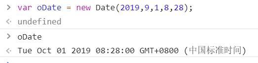

# 有关于时间的常识
## 术语
### 1.时间单位
年(year)
月(month)
日(day)
时(hout)
分(minute)
秒(second)   1s = 1000 ms
毫秒(millisecond) = 1000 us
微秒(microsecond) = 1000 ns
纳秒(nanosecond)
### 2. UTC和GMY
世界划分为24个时区，北京在东八区，格林威治在0时区
GMT:格林威治世界时
UTC:世界协调时(开发经常会用到)
### 3.时间戳
1970-1-1 凌晨  到某个时间 所经历的毫秒数

## 创建时间对象
### 直接调用函数(不适用new)，忽略所有参数，返回当前时间的字符串
.png)
### new Date() 创建日期对象
- 无参数，得到当前时间

- 1个参数(参数为数字，可以传入负数)，表示传入的是时间戳
例如：从1970-1-1凌晨加上 1000 ms，

- 2个参数及以上，分别表示 年，月，日，时，分，秒，毫秒(如果缺失参数，日期部分默认为1，时分秒毫秒默认为0，所有参数均可以传入负数，会根据指定日期进行计算)。要注意月份是从 0 开始的，0 - 11；



## 实例成员
### getDate()
得到日期部分
### getDay()
得到星期几，返回的是数字(1,2,3,4,5,6,0)，0表示星期天
### getFullYear
得到年份（四位数）
### getHours
得到日期的小时部分(24小时制)
### getMinutes
得到分钟部分
### getSeconds()
得到秒
### getMilliseconds()
得到毫秒
### getMonth
得到月，从0 开始计算

### getTime 
得到时间戳

### 设置日期
- setDate()
- set……

### 转换字符串
- toDateString()
将日期部分转换为可读的字符串("星期几 月份 日分 年份")
- toLocaleDateString()
转换成本机(当前系统的地区设置)的易读的字符串("2019/10/19")
- toLocaleString()
除了日期，也转换时分秒
- toLocaleTimeString()
只转换时间部分
日期函数
上面这些使用的基本上很少，我们一般都自己封装
```javascript
function getDateString(){
    // 日期输出的是数字
    // padStart(位，补)如果字符串的数量没有这么多位，在字符串的前面补0并返回补0后的字符串
    // 如果有这么多位，就返回字符串本身
    var date = new Date();
    var year = date.getFullYear().toString().padStart(4,"0");
    var month = (date.getMonth() + 1).toString().padStart(2,"0");

    var day = date.getDate().toString().padStart(2,"0");
    var hour = date.getHours().toString().padStart(2,"0");
    var minute = date.getMinutes().toString().padStart(2,"0");
    var second = date.getSeconds().toString().padStart(2,"0");
    return `${year}-${month}-${day}-${hour}-${minute}-${second}`;
}
```
### 日期的运算
日期对象重写了Objec中的valueOf 方法，返回一个数字，表示时间戳

日期可以进行数学运算

### 日期的练习题


#### 获得 某年某月 有多少天
```javascript
function getDays (year,month){
    return new Date(year,month,0).getDate();
}
```
### 判断某年是不是闰年

```javscript
function isLeapYear(year){
    /**
     * 普通闰年：能被4整除但不能被100整除，2004是，2003不是
     * 
     * 世纪年能被400整除的都是闰年，2000年是闰年，1900年不是闰年
     * 
     * 数值较大的，能整除3200并且能整除172800是闰年：
     * 比如：172800是闰年，86400不是闰年
     */
    if(year % 4 == 0 && year % 100 != 0){
        return true;
    }else if(year % 400 == 0){
        return true;
    }else if(year % 3200 == 0 && year % 172800 == 0){
        return true;
    }else {
        return false;
    }
}
```

#### 给定生日(年月日)，计算一个人的年龄


#### 计算还有多少天过生日

```javascript

// 距离xxx还有多少天多少小时多少分多少秒

function destationDay(year,month,day){
    var desDate = new Date(year,month - 1,day);
    var nowDate = new Date();
    var leap = desDate - nowDate;
    var day = parseInt((leap/(1000*60*60*24)));
    var hour = parseInt((leap/(1000*60*60))%24);
    var mintues = parseInt((leap/(1000*60))%60);
    var seconds = parseInt((leap/(1000))%60);
    return [day,hour,mintues,seconds]
}
```