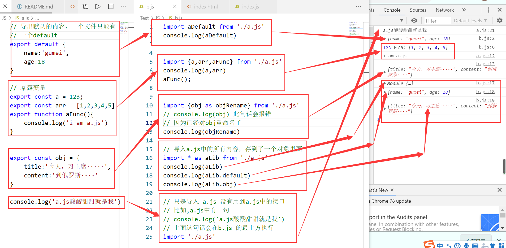
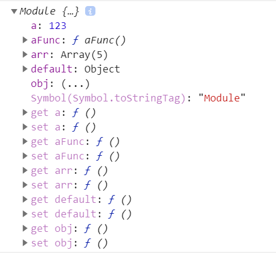

# 关于ES6模块化
在语言的基础上，实现了模块化的功能。一个文件对应一个模块

>ES6自带模块化，可以使用 import 关键字引入模块，通过 export 关键字导出模块，功能较之于前几个方案更为强大，也是我们所推崇的，但是由于ES6目前无法在浏览器中执行，所以，我们只能通过babel将不被支持的import编译为当前受到广泛支持的 require。

# 导出与引入
## export default
一个文件只能有一个 export default,在引入的时候会默认引入export default 导出的内容
- 导出
```js
export default {
    name:'gumei',
    age:18
}
```
- 引入
```js
// 按道理来讲，这里应该可以不用写.js后缀的
import aDefault from './a.js'
// console.log(aDefault)
// 这里的aDefault 可以为任意名字，导出的都是
{
    name:'gumei',
    age:18
}

// export default 是不能在导出时命名的
// 即 export default const obj = {}的写法是错误的，也没有那个必要，因为可以在引入文件里接受默认导出的内容

```
## 暴露变量 export const a = 123



上图中的module
