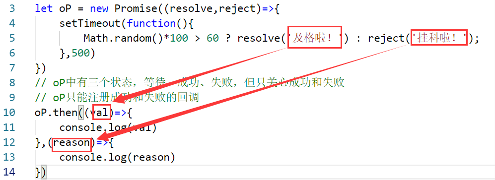
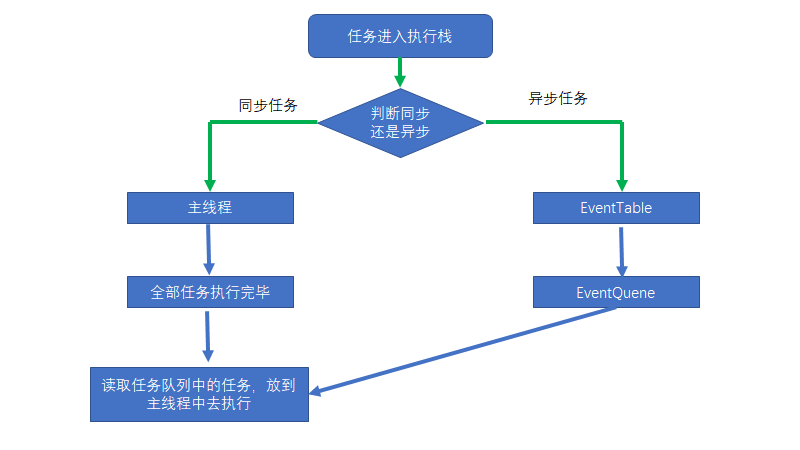
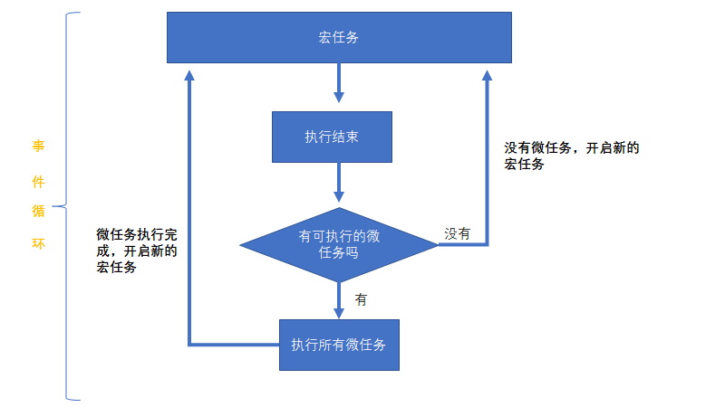

# Promise
Prmoise是浏览器的内置构造函数
## 1. 使用形式
- 传递一个执行器函数作为Promise构造对象的参数，执行器函数可以接受两个参数，分别为resolve,reject，分别**触发**通过oP对象注册的成功和失败的回调
```javascript
let oP = new Promise((resolve,reject)=>{
    //异步操作
})
```
**demo:**
oP.then( )可以只注册成功的回调,也可以只注册失败的回调：
只成功：oP.then(( )=>{ })    
只失败：oP.then(null,( )=>{ })


```javascript
let oP = new Promise((resolve,reject)=>{
    setTimeout(function(){
        Math.random()*100 > 60 ? resolve('及格啦！') : reject('挂科啦！');
    },500)
})
// oP中有三个状态，等待、成功、失败，但只关心成功和失败
// oP只能注册成功和失败的回调
oP.then((val)=>{
    console.log(val)
},(reason)=>{
    console.log(reason)
})
```
**resolve和reject中参数的传递**


- 执行器函数和Promise是同步执行的，在执行器函数里面可以做异步操作
```javascript
let oP = new Promise(()=>{
    console.log(0)
})
console.log(1);
//输出结果先输出0，再输出1，可证明其是同步执行
```
## 2. oP.then( )
oP.then( )是用来注册成功和失败的回调的(上面已有案例)，其注册的函数是异步执行的
### 2.1 注册的回调是异步执行
```javascript
let oP = new Promise((resolve,reject)=>{
    console.log(0);
    resolve(1);//在此处触发成功的回调
})
oP.then((val)=>{
    console.log(val)
},(reason)=>{
    console.log(reason)
})
console.log(2)
// 输出的顺序为 0 2 1，若同步执行输出结果应该为 0 1 2 ，可以证明，Promise中的执行器函数是同步执行的，而通过oP.then( )注册的回调是异步执行的
```
 - 这里的异步执行不是用定时器函数执行的，验证如下：
 ```javascript

let oP = new Promise((resolve,reject)=>{
    setTimeout(function(){
        console.log(0)
    },0)
    console.log(1)
    resolve(2);//在此处触发成功的回调
})
oP.then((val)=>{
    console.log(val)
},(reason)=>{
    console.log(reason)
})
console.log(3)
// 如果注册的回调的异步是通过定时器执行，那么会按照放入任务队列里面的先后顺序进行执行，
// 输出结果应该为： 1 3 0 2 
// 但实际输出却为： 1 3 2 0
// 这说明，注册的回调函数执行的优先级高于定时器，因此，其异步执行不是定时器实现的
```
- 注册函数的异步执行是通过微任务来实现的。异步操作中分为**宏任务**和**微任务**，前者会被先放入任务队列之中，后者会后被放入任务队列之中，但在执行的时候，微任务的优先级要高于宏任务。    
详解如下：   
**EventLoop**

> 同步和异步任务分别进入不同的执行"场所"，同步的进入主线程，异步的进入Event Table并注册函数。当指定的事情完成时，Event Table会将这个函数移入Event Queue。主线程内的任务执行完毕为空，会去Event Queue读取对应的函数，进入主线程执行。上述过程会不断重复，也就是常说的Event Loop(事件循环)。   

**宏任务和微任务**

> 常见的宏任务有setTimeout，setInterval等，微任务有process.nextTick，Promise.then catch finally等

## 3. 链式操作
当使用.then进行链式操作的时候，本次成功回调或者失败回调的参数仅仅与上一次的回调的返回值有关，如果没有返回值，那么本次成功回调或者失败回调的参数就是undefined。
### 3.1 返回值为普通值，或者没有返回值     
前面then执行的返回值是下一个then执行的参数；无论是触发了成功或失败的回调，如果没有抛出错误，下一次then都执行成功的回调
```javascript

let oP = new Promise((resolve,reject)=>{
    setTimeout(function(){
        Math.random()*100 > 60 ? resolve('及格啦！') : reject('挂科啦！');
    },500)
})
oP.then((val)=>{
    console.log(val + 'then1-success');
    return 'then1-success! '
},(reason)=>{
    console.log(reason +' then1-fail');
    return 'then1-fail! '
}).then((val)=>{
    console.log(val + ' then2-success')
},(reason)=>{
    console.log(reason + 'then2-fail!')
})
```
### 3.2 返回值为Promise对象
Promise 对象中触发了失败，下一个then就执行失败，触发了成功，下一个then就执行成功回调；
```javascript
let oP = new Promise((resolve,reject)=>{
    resolve('success ');
})
oP.then((val)=>{
    console.log(val + 'then1-success');
    return new Promise((resolve,reject)=>{
        reject('返回Promise对象，执行失败 ');
    })
},(reason)=>{
    console.log(reason +' then1-fail');
    return 'then1-fail! '
}).then((val)=>{
    console.log(val + ' then2-success')
},(reason)=>{
    console.log(reason + 'then2-fail!')
})
```
### 3.3 抛出错误，下一个then执行失败的回调
```javascript
let oP = new Promise((resolve,reject)=>{
    throw new Error('error')
})
oP.then((val)=>{
    console.log(val + 'then1-success');
    return new Promise((resolve,reject)=>{
        reject('返回Promise对象，执行失败 ');
    })
},(reason)=>{
    console.log(reason +' then1-fail');
    return 'then1-fail! '
}).then((val)=>{
    console.log(val + ' then2-success')
},(reason)=>{
    console.log(reason + 'then2-fail!')
})
```
## 4. catch
catch是用来捕获错误的，除了通过catch，也可以通过oP.then()注册失败的回调函数进行捕获,**抛出的错误的值也就是下一个then执行失败回调(或者是catch捕获到错误)时的参数**
### 4.1 当抛出错误时，只要有一个then接受到了错误，就不会报错；
.then()进行链式调用的时候，写了一个空的then()，对后续操作是没有影响的，可以忽略
```javascript
let oP = new Promise((resolve,reject)=>{
    throw new Error('error')
})
oP.then((val)=>{

}).then(null,(val)=>{
    console.log(val)
})
```
### 4.2 如果错误在catch之前已经被捕获了，那么catch便不会执行
下面这种情况catch是可以捕获到错误的：
```javascript
let oP = new Promise((resolve,reject)=>{
    throw new Error('error')
})
oP.then((val)=>{

}).catch((err)=>{
    console.log(err + ' err')
})
```
但下面这种情况catch捕获不到错误的，因为已经被oP.then()注册的失败回调捕获过了.
```javascript
let oP = new Promise((resolve,reject)=>{
    throw new Error('error')
})
oP.then((val)=>{

}).then(null,(reason)=>{
    console.log(reason)
}).catch((err)=>{
    console.log(err + ' err')
})
```
### 4.3 catch并不是链式调用的终结
可以继续.then进行链式调用,并且catch的返回值会依旧传入到下一个成功或者失败的回调函数的形参里面。

只要在catch当中不抛出错误，.then下一次执行的仍然是成功的回调。

当catch中没有抛出错误时：输出结果为：   
Error: error err   
index.js:32 catch after success 10
```javascript
let oP = new Promise((resolve,reject)=>{
    throw new Error('error')
})
oP.then((val)=>{

}).catch((err)=>{
    console.log(err + ' err');
    return 10;
}).then((val)=>{
    console.log('catch after success ' + val);
},(reason)=>{
    console.log('catch after fail ' + reason);
})
```
当catch中抛出错误时，输出的结果为：   
Error: error err   
catch after fail Error: catch error
```javascript
let oP = new Promise((resolve,reject)=>{
    throw new Error('error')
})
oP.then((val)=>{

}).catch((err)=>{
    console.log(err + ' err');
    throw new Error('catch error')
}).then((val)=>{
    console.log('catch after success ' + val);
},(reason)=>{
    console.log('catch after fail ' + reason);
})
```
## 5. finally( )
finally( )； 终结链式调用

```javascript
let oP = new Promise((resolve,reject)=>{
    throw new Error('error')
})
oP.then((val)=>{

}).catch((err)=>{
    console.log(err + ' err');
    throw new Error('catch error')
}).then((val)=>{
    console.log('catch after success ' + val);
},(reason)=>{
    console.log('catch after fail ' + reason);
}).finally(()=>{
    console.log('over')
})
```
## 6. Promise.all()
Promise.all()可以将多个Promise实例包装成一个新的Promise实例

用来处理并发异步的事情，当并发一堆异步操作，并想要得到一个统一的结果的时候，可以使用Promise.all( )
### 6.1 传参形式
- Promise.all( )参数要传递一个数组，数组放上Promise对象，最后返回的也是一个Promise对象。当数组里面的Promise对象全部触发成功的回调，.then( )才会执行成功的回调函数，有一个失败了，.then( )就会执行失败的回调函数。   
- 如果Promise对象都触发了成功的回调，那么下面这种情况输出的val是一个数组，数组里面的每一项就是每一个promise对象的返回值
Promise.all( [oP1,oP2] ).then((val)=>{
    console.log(val)
})
### 6.2 使用场景举例
当进行前端页面渲染时，需要多个数据进行配合才能进行相应渲染的情况下等，这里只简单的举例子:
```javascript
function getData(bool){
    return new Promise((res,rej)=>{
        if(bool){
            res('success ');
        }else{
            rej('fail ');
        }
    })
}
Promise.all([getData(true),getData(false)]).then((val)=>{
    console.log(val)
},(reason)=>{
    console.log(reason)
})
//当两个promise对象都触发了成功的回调，会执行.then( )成功的回调，其参数val是一个数组，分别保存了两个对象成功后的返回值；

// 当有一个触发失败了的回调，会执行.then( )成功的回调，其参数val的值为第一个触发了失败回调的Promis对象的返回值（不是数组）
```

## 7. Promise.race( )
谁的状态先发生改变，val就是谁的返回值，无论成功还是失败
```javascript
Promise.race([getData(false,'失败咯'),getData(false,'2 也失败咯')]).then((val)=>{
    console.log('success')
    console.log(val)
},(reason)=>{
    console.log('fail')
    console.log(reason)
})
```
上述代码块，谁的状态发生改变，就执行相应的回调函数，比如，先触发了成功的回调，那么就会执行then()中的成功的回调函数，先触发了失败的回调，那么就会执行then()中的失败的回调函数，val或者reason的值为相应的返回值