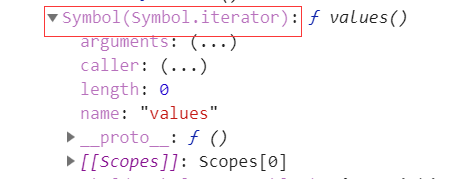
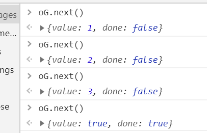
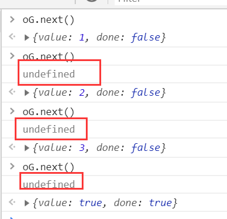
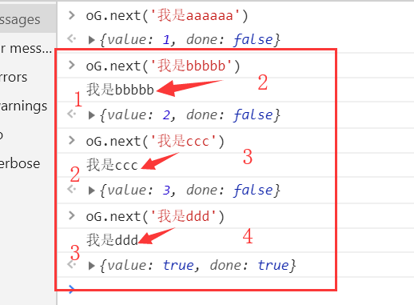

# 1. Generator 是什么以及作用
- generator 是一个生成器，其本质是一个函数，该函数执行后返回迭代对象，函数内部要配合 yield 使 Genetator 分段执行，遇到yield就暂停执行。
- generator 配合promise可解决回调地狱的问题
# 2. 那什么是迭代对象呢
说到什么是迭代对象，那我们首先要来了解一下迭代器是个什么东东。
## 2.1 iterator 迭代器
### 2.1.1 为什么会出现迭代器？
#### 2.1.1.1 迭代模式
提供一种方法可以顺序获得聚合对象中的各个元素，是一种最简单也最常见的设计模式。

它可以让用户透过特定的接口巡访集合中的每一个元素而不用了解底层的实现。forEach

#### 2.1.1.2迭代器的出现
从迭代模式思想中可以看出，就是要标准化迭代操作。

比如：服务端提供数组数据给前端，前端for循环遍历，但由于业务变化，使得数据结构发生变化，返回对象或者set map，导致前端遍历代码大量重写。

解决方案:
  ES6引入Iterator，部署在NodeList、arguments、Array,  Set, Map、字符串上等数据的Symbol.iterator属性。使得这些数据是iterable可迭代的，能进行
for of、... 、Array.from等ES6中的一些方法进行操作

### 2.1.1 迭代器分类
依照与迭代模式的思想而实现，分为内部迭代器和外部迭代器。

### 2.1.1.1 内部迭代器
本身是函数，该函数内部定义好迭代规则，完全接手整个迭代过程，
外部只需要一次初始调用。
比如：Array.prototype.forEach jQuery.each 
### 2.1.1.2外部迭代器：让它迭代它才迭代
本身是函数，执行返回的迭代对象，迭代下一个元素必须显示调用。
提点：调用复杂度增加，但灵活性增强。
**外部迭代器示例**
```javascript
let arr = [1,2,3];
function OuterIterator(params){
    let curIndex = 0;
    console.log(curIndex)
    let next = () =>{
        return {
            value:params[curIndex],
            done:params.length == ++curIndex
        }
    }
    console.log(curIndex)
    return {
        next
    }
}
// 返回一个迭代对象
let oIt = OuterIterator(arr);

```
## 2.2 迭代对象
从上面写的这个外部迭代函数，我们可以看出，最后返回了一个对象，这个对象，就是迭代对象。
## 2.3 迭代器的规则
根据ES6规范，要实现一个迭代器需要遵循以下规则：
- 需要返回一个迭代对象，迭代对象里有 next 这个函数
- next 函数里需要返回一个对象，对象里面有两个属性，分别为 value  和  done ,前者用来记录本次迭代的值，后者用来判断迭代是否结束，如果结束，返回值为true，否则，返回值为false

# 3. Symbol 数据结构
倘若我们从未学习过这一块的内容，那我们会又一个疑惑，什么样的数据是可以进行迭代的， 可以使用 ES6 的 for of 或者 ... 或者 Array.from( ) 呢？

答案是：**具备[Symbol.iterator]** 属性，并且该属性的值为一个迭代器函数，该函数需要遵循迭代器的规则。

我们来看一下数组的该属性：



NodeList、arguments、Array,  Set, Map、字符串等都可以使用ES6的迭代方法进行迭代

那我们来看一下如何给一个不具有迭代接口的对象添加上迭代接口使其可以使用ES6的迭代方法进行迭代。
## 3.1 Symbol 数据结构
### 3.1.1 使用方式
该数据接口直接使用 Symbol ( params ) 执行的方式就可以了，比如：

```javascript
let os = Symbol('gumei')
console.log(os)
// 其在控制台输出的结果如下：
Symbol(gumei)
```
其有两种使用形式，一是参数填入字符串，二是参数填入其他，比如对象
- 参数为字符串
```javascript
let os = Symbol('gumei')
console.log(os)
// 其在控制台输出的结果如下：
Symbol(gumei)
```
- 参数为其他：以对象举例子
当参数不是字符串的话，Symbol会调用传进来的参数的toString( )方法，可以对其进行重写
```javascript 
let obj = {
    name:'gumei',
}
let os = Symbol(obj)
console.log(os)
// 控制台输出结果如下：
Symbol([object Object])
/*********************************/
当重写toString( )方法的时候，其返回值就是Symol( 返回值 )
let obj = {
    name:'gumei',
    toString:function(){
        return 'GUMEIK'
    }
}
let os = Symbol(obj)
console.log(os)
// 控制台输出结果如下：
Symbol(GUMEIK)
```
### 3.1.2 [Symbol.iterator]
我们上面说了，只有具备[Symbol.iterator]属性，并且其值为迭代器函数的聚合对象方可进行迭代，那么如何使一个聚合对象（这里以对象举例子）具备该属性呢？

- 首先，我们可以使用 Symbol('Symbol.iterator') 此种方法来添加该属性 
- 其次，Symbol有一个静态属性iterator可以直接进行使用，我们一般使用这个方法来进行相应的迭代接口部署，即 Symbol.iterator

# 4. 如何使对象可迭代

```javascript
let obj = {
    0:'gumei',
    1:18,
    2:'0',
    length:3,
    [Symbol.iterator]:function(){
        let index = 0;
        let next = () => {
            return {
                value:this[index],
                done:this.length == index++
            }
        };
        return {
            next
        }
    }
}
```
或者：这样做有一定的缺点，具体细节有待研究
```javascript
let obj = {
    name:'gumei',
    age:18,
    money:0,
    [Symbol.iterator]:function(){
        var arr = [];
        for(let prop in this){
            arr.push(this[prop]);
        }
        this.length = arr.length;
        let index = 0;
        let next = () => {
            return {
                value:arr[index],
                done:this.length == index++
            }
        };
        return {
            next
        }
    }
}
```

# 5. 使用Generator改写 4 中的代码

我们已经知道，要使一个聚合对象可迭代的条件之一是要求其迭代器函数返回一个迭代对象，而Generator又是用来生成迭代对象的，那我们就可以使用Generator 对代码进行改写。
## 5.1 Generator 的使用
### 5.1.1 定义一个 Generator 函数
在function 和 函数名 之间加上一个 * 
示例入下：
```javascript
function * Gen(){

}
或者
let Gen = function * (){
    
}
```
### 5.2 使用
### 5.2.1 yield yield表达式，产出不同的内部状态（值）
```javascript
// 分步执行，oG调用一次next()方法，就执行一次
function * Gen(){
    yield 1;
    yield 2;
    yield 3;
    return true;
}
let oG = Gen();
```
在控制台执行以及执行结果如下：

### 5.2.2 拿变量接收
```javascript


function * Gen(){
    let a = yield 1;
    console.log(a)
    let b = yield 2;
    console.log(b)
    let c = yield 3;
    console.log(c)
    return true;
}
let oG = Gen();
```
a,b,c 的输出结果如下：

原因：上述代码执行顺序如下：
- yield 1 
- let a = xxx
- console.log(a)
注意：要注意的是 a 的值并不是 yield 1 产出的值，而是在 下一次  oG.next( params ) 调用时，传进来的参数的值
```javascript
function * Gen(){
    let a = yield 1;
    console.log(a)
    let b = yield 2;
    console.log(b)
    let c = yield 3;
    console.log(c)
    return true;
}
let oG = Gen();
```


### 5.2.3 代码改造
改写前代码
```javascript
let obj = {
    0:'gumei',
    1:18,
    2:'0',
    length:3,
    [Symbol.iterator]:function(){
        let index = 0;
        let next = () => {
            return {
                value:this[index],
                done:this.length == index++
            }
        };
        return {
            next
        }
    }
}
```
改写后代码
```javascript
let obj = {
    0:'gumei',
    1:18,
    2:'0',
    length:3,
    [Symbol.iterator]:function * (){
        let index = 0;
        while(index != this.length){
            yield this[index++]
        }
    }
}
```

# 6. 应用
## 6.1 异步操作场景还原（node环境）

使用Promise处理
```javascript
let fs = require('fs');
function searchAnswer(path){
    return new Promise(( resolve,reject )=> {
        fs.readFile(path,'utf-8',(error,data)=>{
            if(data){
                resolve(data)
            }else{
                reject(error)
            }
        })
    })
}
searchAnswer('./ES6/8.Generator/data/answer1.txt').then((val)=>{
    console.log(val);
    // ./ES6/8.Generator/data/answer2.txt
    return searchAnswer(val)
},(reason)=>{
    console.log(reason)
}).then((val)=>{
    console.log(val);
    // ./ES6/8.Generator/data/answer3.txt
    return searchAnswer(val)
},(reason)=>{
    console.log(reason)
}).then((val)=>{
    console.log(val)
    // 我就是最终的答案啦啦啦爱啦啦啦啦
},(reason)=>{
    console.log(reason)
})
```

Generator 初级改写

```javascript
let fs = require('fs');
function searchAnswer (path){
    return new Promise(( resolve,reject )=> {
        fs.readFile(path,'utf-8',(error,data)=>{
            if(data){
                resolve(data)
            }else{
                reject(error)
            }
        })
    })
}

function * search (){
    let val1 = yield searchAnswer('./ES6/8.Generator/data/answer1.txt');
    let val2 = yield searchAnswer(val1);
    let val3 = yield searchAnswer(val2);
}
let os = search();
let {value , done } = os.next();
// 此时的value就是返回的promise对象
value.then((val)=>{
    let {value , done } = os.next(val);
    value.then((val)=>{
        let {value,done} = os.next(val);
        value.then((val)=>{
            console.log(val)
        })
    })
})
```

升级改写：递归优化
```javascript
let fs = require('fs');
function searchAnswer (path){
    return new Promise(( resolve,reject )=> {
        fs.readFile(path,'utf-8',(error,data)=>{
            if(data){
                resolve(data)
            }else{
                reject(error)
            }
        })
    })
}

function * search (){
    let val1 = yield searchAnswer('./ES6/8.Generator/data/answer1.txt');
    let val2 = yield searchAnswer(val1);
    let val3 = yield searchAnswer(val2);
}
// // 返回promise是为了方便处理执行的结果
// 接收参数为迭代对象
function Co(oIt){
    return new Promise((res,rej)=>{
        let next = (data)=>{
            let {value,done } = oIt.next(data);
            if(done){
                res(value)
            }else{
                value.then((val)=>{
                    next(val);
                },rej)
            }
        }
        next();
    })
}

Co(search() ).then((val)=>{
    console.log(val)
},(reason)=>{
    console.log(reason)
})

```