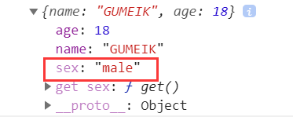
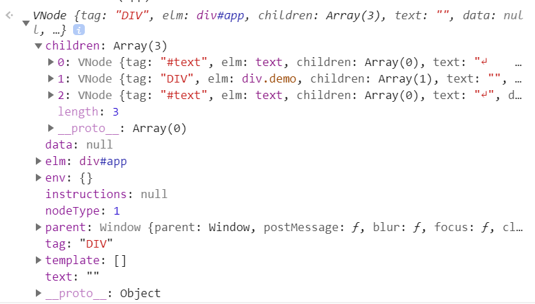

# Vue 中的代理
## 知识点
- 当我们使用 Object.defineProperty( ) 监听对象中一个不存在的属性的时候,会自动给这个对象加上这个属性
eg:
```javascript
let obj = {
    name:'GUMEIK',
    age:18
}
Object.defineProperty(obj,'sex',{
    get(){
        return 'male';
    }
})
console.log(obj)
//输出的结果为：
```

## vm.data.name--->data.name
我们都知道，在Vue中，可以直接根据vm.xxx拿到实例data里面的数据，那么这个是怎么实现的呢？其实原理很简单，就是 **当给一个对象代理一个自身不存在的属性的时候，这个对象就会拥有这个属性(见本页知识点部分)**
```javascript
const vm = {
    el:'#app',
    data:{
        name:'GUMEI',
        age:18
    }
}
// vm.data.name ---->vm.name
// 原理:给一个对象，代理不存在的属性，那么这个对象上
// 就会拥有这个属性
for(let prop in vm.data){
    Object.defineProperty(vm,prop,{
        get(){
            console.log('get')
            return vm.data[prop];
        },
        set(value){
            console.log('set')
            vm.data[prop] = value;
        }
    })
}
// 上述方法不会造成死循环的原因为代理的是vm,无论取值还是赋值操作的都是vm.data[prop],而不是vm[prop]

// 此时，我们就可以通过vm.name 拿到相应的值了
```
## 对象的代理
```javascript
// 传入一个对象，返回一个代理后的对象
// 无论取值和赋值都是操作的obj
// 因此可以认为就是直接操作obj
// 这样写的目的是为了避免取值或赋值时造成死循环
// 虽然这样对空间要求可能不太好，应有更好的方法
// 待探究
function proxyObject(obj){
    let proxyObj = {};
    for(let prop in obj){
        Object.defineProperty(proxyObj,prop,{
            configurable:true,
            get(){
                return obj[prop];
            },
            set(value){
                obj[prop] = value;
            }
        })
    }
    return proxyObj;
}
// 通过上面这种方法代理的对象只能代理原始值，当代理的属性为引用值时，取值和赋值时可以出发get事件，但不能触发set事件.(obj.objChild.name)如果想对属性值进行操作，则还需要进行一步处理。改进如下：
function proxyObject(obj){
    let proxyObj = {};
    for(let prop in obj){
        Object.defineProperty(proxyObj,prop,{
            configurable:true,
            get(){
                return obj[prop];
            },
            set(value){
                console.log('在此处，进行一系列操作')
                obj[prop] = value;
            }
        })
        // 如果obj[prop] 仍然为一个对象，就继续进行代理
        if(obj[prop] instanceof Object){
            proxyObj[prop] = proxyObject(obj[prop])
        }
    }
    return proxyObj;
}
// obj.objChild.name = 1  ;此时就可以触发set事件了
```
## 数组的代理
```javascript
// 在vue中，直接改变数组索引和数组长度是无法被感知到的，可以使用vue的变异方法来进行感知。 因此对数组的代理主要是对数组的变异方法来进行代理
function proxyArray(arr){
    let obj = {
        push(){},
        pop(){},
        shift(){},
        unshift(){}
    }
    const arrayPrototype = Array.prototype;
    for(let prop in obj){
        Object.defineProperty(obj,prop,{
            enumerable:true,
            configurable:true,
            value:function(...args){
                console.log('当数组发生变化时，在此处做一些操作');
                let result = arrayPrototype[prop].apply(this,args);
                return result;
            }
        })
    }
    arr.__proto__ = obj;
    return arr;
}
```
# vue 中的虚拟dom
## 构建虚拟 dom 的雏形
```javascript
// 虚拟dom树
function VNode(
    tag,//标签类型
    elm,//对应的真实节点
    children,//当前节点下的子节点
    text,//当前虚拟节点中的文本
    data,//
    parent,//父级节点
    nodeType//节点类型
    ){
        this.tag = tag;
        this.elm = elm;
        this.children = children;
        this.text = text;
        this.data = data;
        this.parent = parent;
        this.nodeType = nodeType;
        this.env = {};//当前节点的环境变量
        this.instructions = null;//存放指令
        this.template = [];//当前节点的所在的模板
}

// 构建虚拟dom树
function constructVNode(root){
    let vnode = null;
    let children = [];
    // 看节点是否含有文本，只有文本节点才会含有文本
    let text = getNodeText(root);
    let data = null;
    let nodeType = root.nodeType;
    let tag = root.nodeName;
    vnode = new VNode(tag,root,children,text,data,parent,nodeType);
    let childs = vnode.elm.childNodes;
    //     let childs = root.childNodes;
    // 对每一个子节点再次进行dom数的构建
    // 深度优先搜索
    for(let i = 0;i < childs.length;i++){
        // 获取子节点的虚拟dom树
        let childNodes = constructVNode(childs[i]);
        // 将子节点的虚拟dom树放进父节点的虚拟dom树的children属性里面
        // 构建的虚拟dom树可能是单一节点，也有可能返回节点数组
        // 如果childNodes是一个单一元素的话，那么childNodes就是VNode构建出来的
        // 如果childNodes是一个数组，那么构建出来它的应该是Array
        // 当然，也可以换成其他的方式进行判断
        if(childNodes instanceof VNode){
            vnode.children.push(childNodes);
        }else{
            vnode.children = vnode.children.concat(childNodes);
        }
    }
    return vnode;
}
// 看该节点是否含有文本
function getNodeText(node){
    if(node.nodeType == 3){
        return node.nodeValue;
    }else{
        return '';
    }
}
let app = document.getElementById('app');
constructVNode(app);
// 这样虚拟dom的雏形就构建了，但环境变量，data,template等东西还没有进行设置，在控制台打印的截图如下：
```


## 构建模板节点索引,进行预备渲染
```
1. 通过模板查找用到模板的节点

基本思路：找到所有的模板(template),每个模板都对应着一个虚拟的文本节点。

循环所有的模板，将用到模板的虚拟节点放到 map 结构里面。

第一次循环：(t1,v1)
map是空的，就将循环到的第一个模板及其虚拟节点放到map里面，(t1 ==> [v1]);

第二次循环:(t2,v2)
先查看map结构里面有没有 t1 这个属性：
- 如果有这个属性，就把本次循环对应的虚拟节点 放到t1里面:map(t1 ==> [v1,v2]);
- 如果没有这个属性，就把t2放到map里面 map(t1 ==> [v1],t2 ==> [v2])

剩下的循环继续上面的步骤

2. 通过节点查找用到的模板

循环所有的模板，以节点作为属性，模板作为值

第一次循环:(t1,v1)
map中没有值，将v1作为属性值 v1 ==> [t1]

第二次循环:(t2,v2)
看v2这个节点是不是v1(因为一个虚拟节点里面的text可能包含多个模板，而循环的是所有的模板，所以，循环传入的虚拟节点有可能是同一个)？
- 如果是，则 map{ v1 ==> [v1,t2]}
- 如果不是，则 map { v1 ==> [t1],v2 ==> [t2] }
```

```javascript
// 预备渲染最重要的内容就是建立索引
// 落实到代码里面就是获取template2Vnode和vnode2template这两个map结构
let app = document.getElementById('app');
// 得到虚拟节点
let vnode = constructVNode(app);

// 建立映射关系
// 通过模板找节点(通过模板查找哪些节点用到了这个模板)
let template2Vnode = new Map();
// 通过节点找模板(通过这个节点查看节点下有哪些节点)
let vnode2template = new Map();


// 进行预备渲染
function prepareRender(vnode){
    if(vnode == null) return;
    if(vnode.nodeType == 3){//文本节点
        // 分析模板字符串
        // 如果没有匹配到符合要求的字符串，templateSrtList值为null
        // 如果匹配成功，则返回数组，即便只有一个值
        let templateSrtList = vnode.text.match(/{{[a-zA-Z0-9_.]+}}/g);
        if(templateSrtList){
            for(let i = 0;i < templateSrtList.length;i++){
                // 看有哪些节点使用了这个模板
                setTemplate2Vnode(templateSrtList[i],vnode);
                // 看这个节点有哪些模板
                setVnode2Template(templateSrtList[i],vnode);
            }
        }
    }
    if(vnode.nodeType == 1){//标签节点
        // 看其子节点是否是文本节点
        for(let i = 0;i < vnode.children.length;i++){
            prepareRender(vnode.children[i]);
        }
    }
}
prepareRender(vnode);

// 通过模板设置有哪些节点用到了这个模板
function setTemplate2Vnode(template,vnode){
    // template 是通过vnode.text 属性获取到的
    // template 就是获取到的所有的文本节点可能是模板的
    // 每个模板都对应一个文本节点
    // setTemplate2Vnode在上面会被循环调用
    // 通过map映射，将节点和模板对应起来
    let templateName = getTemplateName(template);
    let vnodeSet = template2Vnode.get(templateName);
    if(vnodeSet){
        vnodeSet.push(vnode);
    }else{
        template2Vnode.set(templateName,[vnode]);
    }
    // template2Vnode的值 
    // Map(2) {"content" => Array(2), "description" => Array(1)}
    // 意思就是content这个模板，被两个节点进行使用
    // description这个模板，被一个节点进行使用
}
// 通过节点查看，这个节点有哪些模板
function setVnode2Template(template,vnode){
    let templateSet = vnode2template.get(vnode);
    if(templateSet){
        templateSet.push(getTemplateName(template));
    }else{
        vnode2template.set(vnode,[getTemplateName(template)]);
    }
}


// 获取模板名字
function getTemplateName(template){
    if(template.substring(0,2)=="{{" && template.substring(template.length - 2,template.length) == '}}'){
        return template.substring(2,template.length - 2);
    }else{
        return template;
    }
}
```
## 进行文本节点渲染
```
为了方便调试，在构建虚拟dom的时候(constructVNode构造函数里面)，手动给vnode.data赋值:

let data = {
    content: 'hello啊，树哥！',
    description: 'GUMEI牛逼！'
}
```
```javascript
// 渲染
function renderNode(vnode) {
    // 渲染文本节点
    if (vnode.nodeType == 3) {
        // 把当前节点下的模板取出来
        let templates = vnode2template.get(vnode);
        if (templates) {
            // vnode上的text的值我们是不改变的
            let result = vnode.text;
            for (let i = 0; i < templates.length; i++) {
                let templateValue = vnode.data[templates[i]];
                if(templateValue){
                    // 替换文本节点的内容
                    result = result.replace('{{'+ templates[i] +'}}',templateValue);
                }
            }
            // 将替换后的文本重新赋值到元素身上
            vnode.elm.nodeValue = result;
        }
    } else {
        for (let i = 0; i < vnode.children.length; i++) {
            renderNode(vnode.children[i]);
        }
    }
}
renderNode(vnode)
```
## 修改属性自动进行渲染
```
就是在代理对象的时候，进行renderNode操作就ok了，由于目前不方便操作，所以此部分放到最后面来说明
```
# 属性
## v-modal

