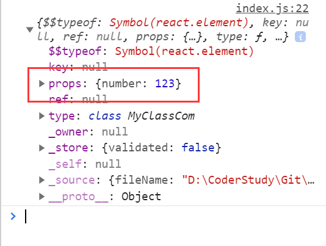

# 组件和组件属性

组件：包含内容、样式和功能的UI单元

## 创建一个组件

**特别注意：组件的名称首字母必须大写**

1. 函数组件
   (使用组件生成的任然是react元素，变化的只是type值，会根据大小写判断是否是组件还是普通的元素)
返回一个React元素
- 使用方法一(这种方法一般不进行使用，因为构不成组件结构，不方便以后的调试等操作)
```jsx
function MyCom(){
    return (
        <h1>
            组件内容
        </h1>
    )
}
ReactDOM.render( <div>
    {MyCom()}
</div>,document.getElementById('root'))
```
- 使用方法二(比较常用，具有组件结构)
```jsx
ReactDOM.render( <div>
    <MyCom></MyCom>
</div>,document.getElementById('root'))
```
2. 类组件

必须继承React.Component

必须提供render函数，用于渲染组件
```jsx
class MyClassCom extends React.Component {
    render (){
        return (
            <h1>
            类组件内容
        </h1>
        )
    }
}
ReactDOM.render( <div>
    <MyClassCom></MyClassCom>
</div>,document.getElementById('root'))
```
## 组件的属性

1. 对于函数组件，属性会作为一个对象的属性，传递给函数的参数

```jsx
function MyCom(obj){
    // 和类组件一样，这里传递进来的obj也是组件对象的props属性
    console.log(obj)
    return (
        <h1>
            我是一个函数组件
        </h1>
    )
}
ReactDOM.render( <div>
    <MyCom number={123}></MyCom>
</div>,document.getElementById('root'))
console.log(<MyCom number={123}></MyCom>)
```

2. 对于类组件，属性会作为一个对象的属性，传递给构造函数的参数
- 当我们给一个类组件(其实也是react元素)添加一个属性时，这个对象就会有props这个属性，如下图：
```jsx
<MyClassCom number={123}></MyClassCom>

console.log(<MyClassCom number={123}></MyClassCom>)
```

- 在类组件中该如何使用这个传递过来的属性呢？
```jsx
class MyClassCom extends React.Component {
    constructor(obj){
        super(obj);
        // 这里传递过来的obj，其实就是react元素中的props对象
        // 在这里可以传过来的属性进行一些列渲染等操作
        
        // 需要注意的是：
        // 1.传递过来的值可以是任何类型(普通对象，react元素，布尔值等)
        // 2.传递过来的值不允许被修改(尽管当传递的属性是对象，虽然不能更改对象的值，但是能更改对象里面的值，但不建议这样做，出错了调试起来异常困难)
        console.log(obj)
    }
    render (){
        // 在这里可以通过 this.obj拿到传递过来的对象
       return (
            <h1>
            类组件内容
        </h1>
        )
    }
}

```
注意：组件的属性，应该使用小驼峰命名法

**组件无法改变自身的属性**。

之前学习的React元素，本质上，就是一个组件（内置组件）

React中的哲学：数据属于谁，谁才有权力改动

**React中的数据，自顶而下流动**