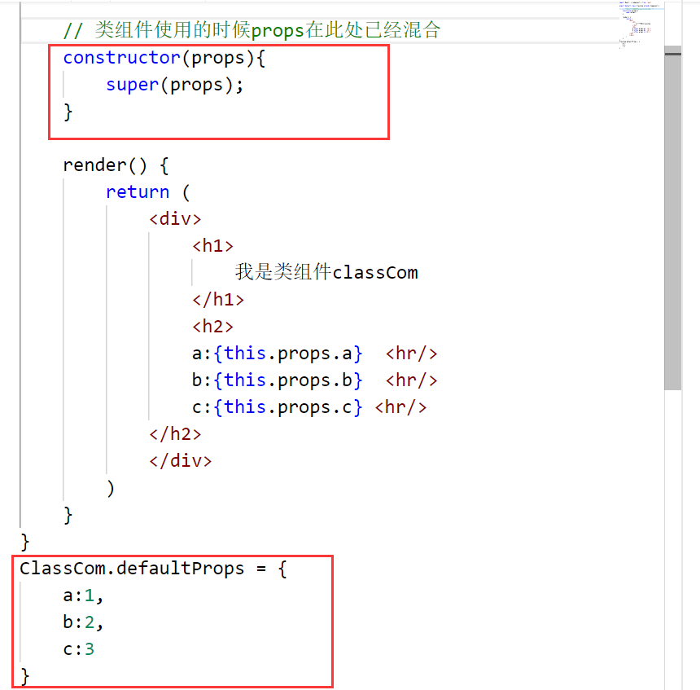
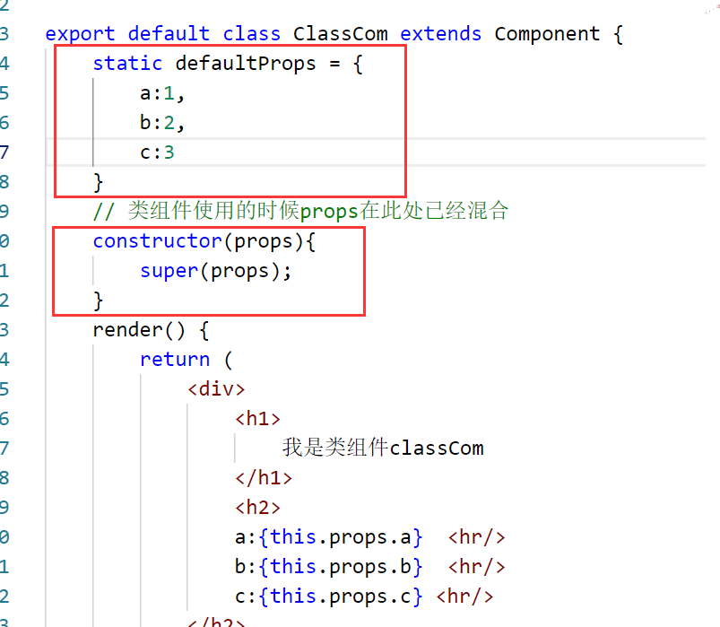
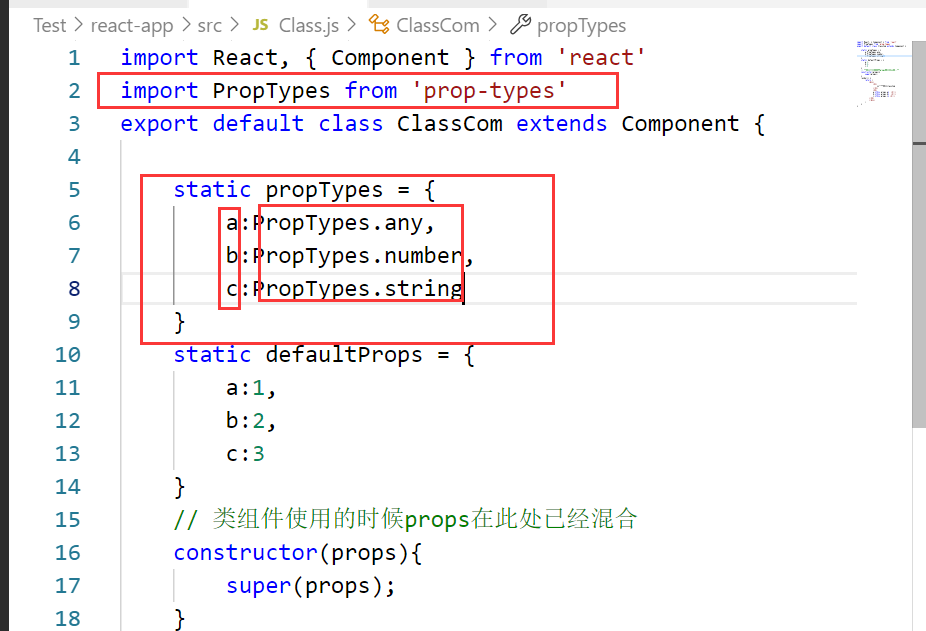

# 属性默认值 和 类型检查

## 属性默认值

### 函数组件的属性默认值
>对于函数来说，静态属性就是函数本身的属性，比如Date.now()这个时间戳，就是Date函数上面的一个静态属性
通过一个静态属性```defaultProps```告知react属性默认值
```jsx
export default function FuncCom (props){
   // 在这里得到的props已经是传入的对象和defaultProps混合之后的值了
   console.log(props)
    return (
        <div>
            <h1>我是函数组件FuncCom</h1>
            <h2>
                a:{props.a}  <hr/>
                b:{props.b}  <hr/>
                c:{props.c} <hr/>
            </h2>
        </div>
    )
}
// 当没有给这个函数组件传值时，函数组件默认使用静态属性defaultProps里面的值
FuncCom.defaultProps = {
    a:1,
    b:2,
    c:3
}
```
### 类组件的属性默认值
类的本质就是函数，所以，也只需要给其加上静态属性就可以使用默认属性了，鉴于类的特性，有两种方式可以为类组件添加默认属性，，分别如下：
- 

- 


## 属性类型检查

属性类型检查需要使用库：```prop-types```，在脚手架构建的工程下面react已经导入了该库，可直接进行使用。

没必要进行状态检查，状态是自己的，属性是别人的。

对组件使用静态属性```propTypes```告知react如何检查属性

由于函数也具有静态属性，所以函数组件也可以进行类型检查，但这里只以类组件举例子


```js
PropTypes.any：//任意类型
PropTypes.array：//数组类型
PropTypes.bool：//布尔类型
PropTypes.func：//函数类型
PropTypes.number：//数字类型
PropTypes.object：//对象类型
PropTypes.string：//字符串类型
PropTypes.symbol：//符号类型

PropTypes.node：//任何可以被渲染的内容，字符串、数字、React元素
PropTypes.element：//react元素
PropTypes.elementType：//react元素类型
PropTypes.instanceOf(构造函数)：//必须是指定构造函数的实例
PropTypes.oneOf([xxx, xxx])：//枚举
PropTypes.oneOfType([xxx, xxx]);  //属性类型必须是数组中的其中一个
PropTypes.arrayOf(PropTypes.XXX)：//必须是某一类型组成的数组
PropTypes.objectOf(PropTypes.XXX)：//对象由某一类型的值组成
PropTypes.shape(对象): //属性必须是对象，并且满足指定的对象要求
PropTypes.exact({...})：//对象必须精确匹配传递的数据

//自定义属性检查，如果有错误，返回错误对象即可
属性: function(props, propName, componentName) {
   //...
}
```