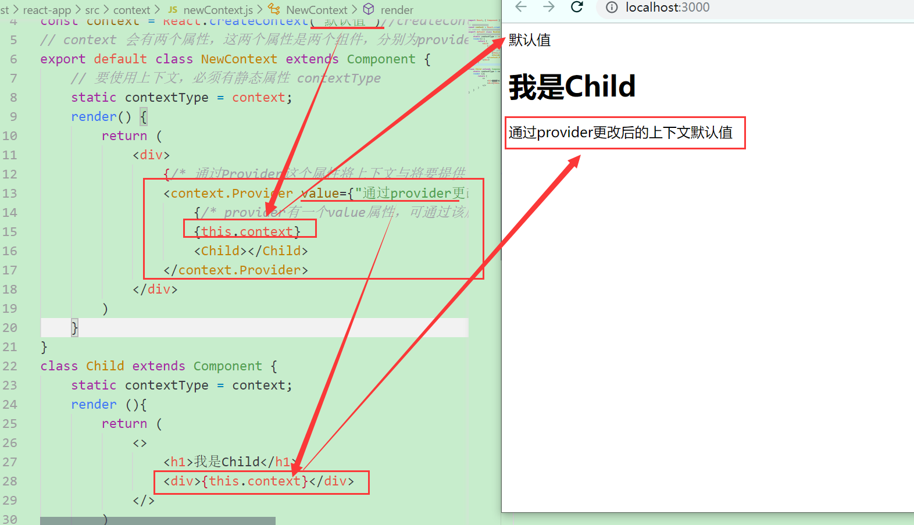

# 新版上下文的改变
- 提升了效率，防止滥用问题
- 上下文与组件是独立开的，通过context.Provider 这个组件将要提供上下文的组件与上下文进行关联
# 一：类组件中上下文的创建以及使用
## 1.创建上下文
**一般来说，一个上下文不要在不同的组件树中使用，如果有此种场景，应该提升provider或者再创建一个上下文对象**
```jsx
const context = React.createContext("默认值")//createContext传递的参数为上下文的默认值，当然也可以不传递
```
## 2.将要提供上下文的组件与上下文进行关联
**此处假设组件NewContext为提供上下文的组件**
**此步骤确认NewContext为提供上下文的组件，里面有子组件Child，Child就可以使用上下文中的数据了**
```js
class NewContext extends Component {
    render() {
        return (
          <context.Provider>
               <Child></Child>
          </context.Provider>
        )
    }
}
```
## 3.使用上下文中的数据
**Provider组件有value属性，用于上下文中数据的更改或者重新赋值，若没有填写该属性，子组件中是无法取得上下文中的数据的**

**value的值通常都是提供上下文的组件中的state或者props提供的**
```jsx
<context.Provider value={"通过provider更改后的上下文默认值"}>
```
- 设置contextType 静态属性,其值为创建的上下文对象context
- 通过this.context来取得上下文中的数据
```jsx
class Child extends Component {
    static contextType = context;
    render (){
        return (
            <>
                <h1>我是Child</h1>
                <div>{this.context}</div>
            </>
        )
    }
}
```

# 关于React.createContext("默认值")参数填的默认值
这个默认值一般不填写，而是通过Provider的value属性重新赋值。如果填写了默认值，也只能在提供了上下文的组件中使用：


# 二：函数组件中上下文的创建以及使用
**在函数组件中使用就不需要提供静态属性context了，使用Consumer组件就可以了**

**当value属性发生变化时，会导致context.Provider中所有的后代元素重新渲染，无论后代元素有没有优化(使用纯函数等)**


**每次setState之后得到的state对象都是一个全新的对象，若想进行性能优化可将数据多套一层对象**
```jsx
state = {
    ctx:{
        value:111
    }
}
// 可利用下面这种方式进行优化
<context.Provider value={this.state.ctx}></context.Provider>
```

**Consumer的子节点为一个函数，该函数接受一个参数value,value就是上下文中的数据，该函数的返回值会作为react元素显示到界面上,要注意的是，要使用上下文的函数组件只能有一个子结点并且必须是一个函数**

使用示例如下：
```jsx
function Child() {
        return (
               <context.Consumer>
                    {(value)=>{
                        console.log(value)
                         // return <h1>{value}</h1>
                    }}       
               </context.Consumer> 
        )
}
```

**使用Consumer组件使用上下文数据，此种方法在类组件中同样使用，一般来说，提供上下文的组件为类组件，因为其数据很有可能是从类组件的state中获取的**

示例如下：
```jsx
class Child extends Component {
       render(){
        return (
            <context.Consumer>
                 {(value)=>{
                     console.log(value)
                      return <h1>{value}</h1>
                 }}       
            </context.Consumer> 
     )
       }
}
```