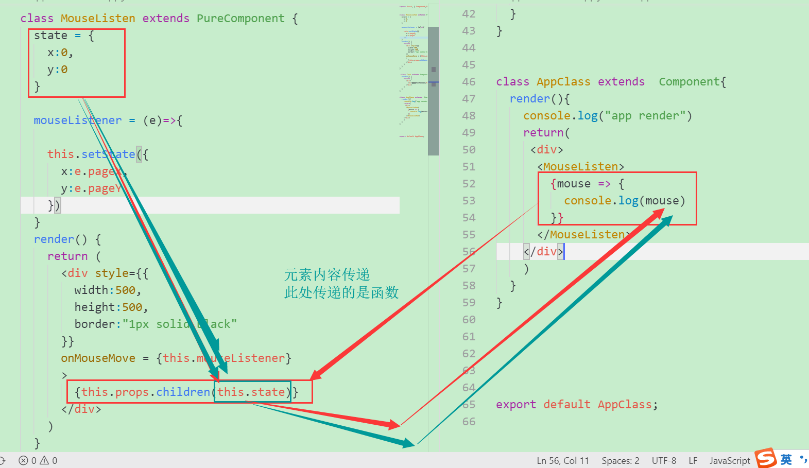

# render props

有些时候，某些组件的各种功能及处理逻辑几乎完全相同，只是显示的届满不一样，建议使用上面的 render props 乎哟这HOC(高阶组件) 来解决代码重复的问题(横切关注点)

## render props
- 某个组件，需要某个属性，比如鼠标相对于某容器的位置(可能有多个组件都需要这个位置)
- 该属性是一个函数，函数的返回值用于渲染或进行其他操作 
- 函数的参数会传递为需要的数据
- 注意纯组件的属性(尽量避免每次传递的render props的地址不一致)
- 通常该属性的名字叫做 render