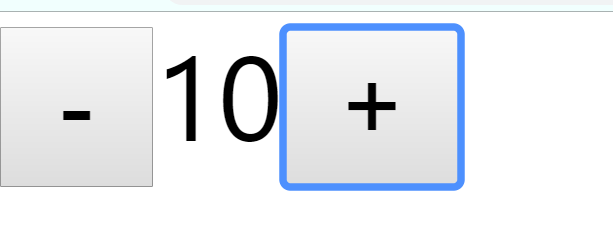

# State Hook

State Hook是一个在函数组件中使用的函数（useState），用于在函数组件中使用状态,需要导入


useState

- 函数有一个参数，这个参数的值表示状态的默认值(如果该参数没有填写，则默认为undefined)
- 该函数只能在函数组件的函数体中进行使用，不能在外面进行使用，否则会报错
- 函数的返回值是一个数组，该数组一定包含两项
  - 第一项：当前状态的值
  - 第二项：改变状态的函数


- 使用举例:
点击加号数字加1，点击减号数字减一

```jsx
import React,{useState} from 'react';

function App(){
  // 传入的值是状态的默认值，这里我们设置默认值为 10；
  // 这里的默认值可以是原始值，而不像类组件中只能是对象
  // 该函数返回一个长度为2的数组，第一位就是状态的默认值。第二位是用来改变状态的函数
  let numState = useState(10);
  let num = numState[0];
  // 状态改变函数放入一个参数，该参数就是把原来的状态要变为现在的哪个状态
  // 比如将n 变为n+1
  let setNum = numState[1]
//   用ES6结构化赋值就更方便了
// let [num,SetNum] =  useState(10)
  return (
    <div>
      <button onClick={
        ()=>{
          setNum(num - 1)
        }
      }>-</button>

      <span>{num}</span>

      <button onClick={
        ()=>{
          setNum(num + 1)
        }
      }>+</button>
    </div>
  )
}
```

一个函数组件中可以有多个状态，这种做法非常有利于横向切分关注点。

**注意的细节**

1. useState最好写到函数的起始位置，便于阅读
2. useState严禁出现在代码块（判断、循环）中
3. useState返回的函数（数组的第二项），引用不变（节约内存空间）
4. 使用函数改变数据，若数据和之前的数据完全相等（使用Object.is比较），不会导致重新渲染，以达到优化效率的目的。
5. 使用函数改变数据，传入的值不会和原来的数据进行合并，而是直接替换。
6. 如果要实现强制刷新组件
   1. 类组件：使用forceUpdate函数
   2. 函数组件：使用一个空对象的useState
7. **如果某些状态之间没有必然的联系，应该分化为不同的状态，而不要合并成一个对象**
8. 和类组件的状态一样，函数组件中改变状态可能是异步的（在DOM事件中），多个状态变化会合并以提高效率，此时，不能信任之前的状态，而应该使用回调函数的方式改变状态。如果状态变化要使用到之前的状态，尽量传递函数。