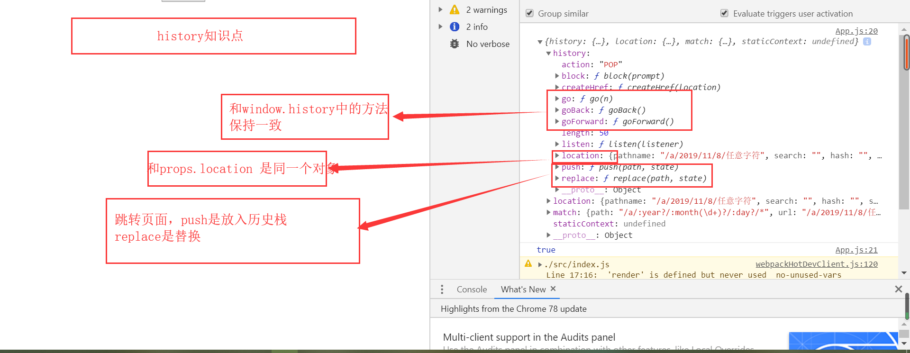
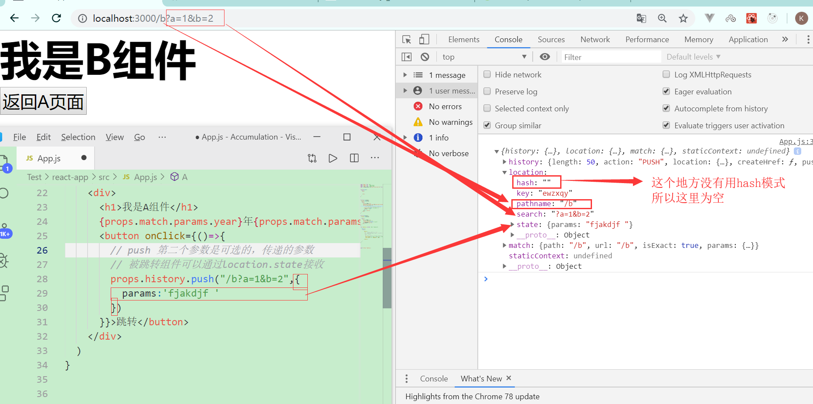
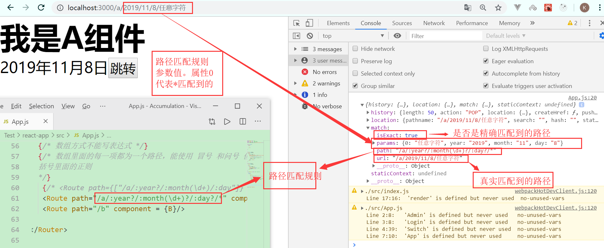

# 路由信息
这并不是官方的叫法，只是为了方便，取了这个名字，因为其有些部分类似于vue种的路由元信息，所以取了这个名字。
```这里的路由信息 指当一个组件被加载时，Router 给组件提供的上下文中的三个属性，分别是 location history match```
当组件在Router中使用时，当路径 匹配到了某个组件，会以props 的形式，将这三个参数，传递给匹配到的组件
```jsx
function C(props){
  console.log(props)
  return (
    <div>
      <h1>C页面</h1>
    </div>
  )
}
```

## history
用来进行编程式跳转

### push
push 有两个参数
- 参数一（必选）：要跳转到的路径
- 参数二(可选)：要传递的参数
### replace
使用方法和push 一致，不一样的地方在于一个是新增历史栈，一个是替换历史栈



## location 
记录路径的相关信息


## match
记录路径匹配的相关信息

### :冒号
: 类似于vue中的动态路由

### ？问号
？ 表示该参数可有可无

### *星号
    *表示任意匹配内容

### （）小括号
() 中可以书写正则表达式来对匹配的内容进行限制。但是要注意的是，只有当path是非数组形式的时候，该设置才有效   
**举例：**
```jsx
<Route path="/a/:year?/:month(\d+)?/:day?/*" component = {A}/>
```



## 高阶组件 withRouter
该组件是react-route 中的一个高阶组件，其作用在于给一个普通组件注入Router的上下文环境，以便其可以进行跳转等路由操作。

为什么会有这个属性呢，因为当一个组件没有在路由中被使用时，是不会有上面三个路由信息的，也就无法进行跳转等路由操作。当然，也可以通过 props 将带有**路由上下文**的组件传递给子组件，只是此种方法 在组件较多的时候不太方便使用
**示意**
```jsx
import {BrowserRouter as Router,Route,Switch,withRouter} from 'react-router-dom'
function Test(){
    return (
        <div></div>
    )
}
const TestWrapper = withRouter(Test);
// 这个时候的TestWrapper 已经具备路由信息了，可以进行相应的操作了。
```