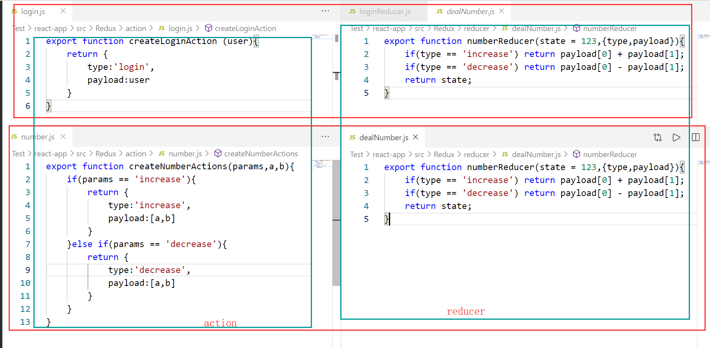

# 实现加减法运算
这里的处置可能不太妥当，理论上来说，数据应该初始化在state中，但本例子是操作的action中的数据，action应该是用来描述数据的，虽然其可以利用创建函数接受参数。

由于是初学，本处暂且这样处理，日后再做改善。估计小型项目用不到redux。
```js
import {createStore} from 'redux'
// action 创建函数
function createActions(params,a,b){
    if(params == 'increase'){
        return {
            type:'increase',
            payload:[a,b]
        }
    }else if(params == 'decrease'){
        return {
            type:'decrease',
            payload:[a,b]
        }
    }
}

function reduce(state ,{type,payload}){
    if(type == 'increase') return payload[0] + payload[1];
    if(type == 'decrease') return payload[0] - payload[1];
    return state;
}

const store = createStore(reduce);

// 执行加法 5 + 8 = 13
store.dispatch(createActions('increase',5,8));

// 执行减法 8 - 2  = 6;
store.dispatch(createActions('decrease',8,2));
```

# 合并reducer
假设现在有不同的数据需要做不同的处理，但一个store 只能有一个reducer ,所以需要涉及到reducer的分发与合并的问题。

本次假设有两种类型的数据，一种数据需要做加减运算，另一个数据需要做登录操作。


合并与使用reducer


输出结果如下：


```js
export default (state = {
    numberState:11111,
    loginState:'didididi'
},action)=>{
    // console.log(state,action)
    const newState = {
        // state.numberState可以设置初始值，也可以不设置
        // numberReducer 就负责处理state.numberState中的数据，不需要把整个state都传给numberReducer，每一个reducer都只负责自己应该处理的事情就好了
        // 处理好之后会将处理之后的数据返回，然后numberState就接收到了处理之后的数据
        numberState:numberReducer(state.numberState,action),
        loginState:loginReducer(state.loginState,action)
    }
    return newState;
}
```