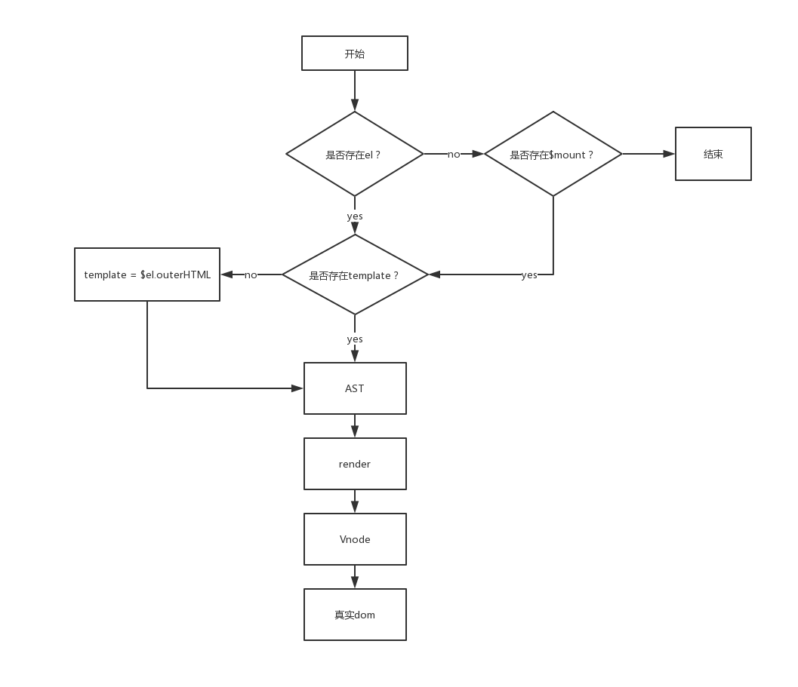

# 具体细节
- 显示在页面上的元素已经被完完全全的替换掉了
```html
写的是：
<div> {{ content }} </div>
被渲染成为：
<div> hello </div>
```
- 看有没有el这个属性，有的话拿到el.outerHtml  (如果没有template的话) 构建抽象语法树，经过渲染，生成虚拟dom，再映射成为真实dom。如果没有el这个属性，就看以后没有$mount，重复以上步骤。
- 如果有template 那么el.outerHtml 就不会生效了

- render 函数
用于组件中动态生成标签

也可以使用jsx语法


如果有render函数存在，template就不会生效了

```javascript
有一个子元素
render ( createment ){
    // 需要有返回值，传入的参数为一个函数，可以用来生成标签
    return createment('h1',{
        class:'demo',
        style:{
            color:'red'
        },
        domProps:{
            innerHTML:"didididiid"
        }
    },'我是一个h1 标签');
}

有多个子元素
render ( createment ){
    // 需要有返回值，传入的参数为一个函数，可以用来生成标签
    return createment('h1',{
        class:'demo',
        style:{
            color:'red'
        },
        domProps:{
            innerHTML:"didididiid"
        }
    },['我是一个h1 标签',
    createment('p','我是一个p标签')
    ]);
}
```