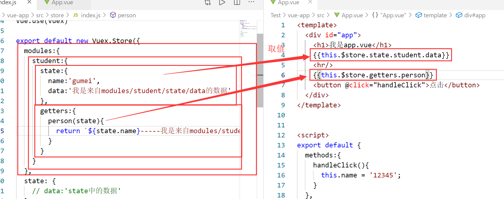

在store.js中还有一个modules的属性，里面的内容和store中的内容基本一致(state,getters,mutations,actions)


# 使用时发生的变化

>分模块以后，会将该某块的state放到该模块下，getters，mutations，actions都会放到全局下：
所以，要通过如下方式进行获取：
此处的 this 可以不写


- 通过this.xxx……来获取的时候
```js
this.$store.state.student.xxx                 //state
this.$store.getters.xxx                       //getters
this.$store.commit('change',{price:20})      //mutations
this.$store.dispatch('xxx')                   //actions
```

- 通过导入的方式获取时
```js
// getters
...mapGetters(['xxx'])                 //mapGetters


// state
...mapState('模块名',['xxx'])，此外，还要给该模块添加namespace

modules:{
    namespace:true
}
// 当给了state 命名空间以后，getters.muations.actions就不能通过原来的方式来拿了

this.$store.模块名.getters.xxx              //getters
也可以写成this.$store['模块名/getters'].xxx          
...mapGetters('模块名',['xxx'])            //mapGetters
this.$store.commit('模块名/change',{price:20}//mutations
this.$store.dispatch('模块名/xxx')            //actions
```

