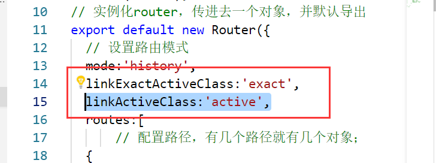
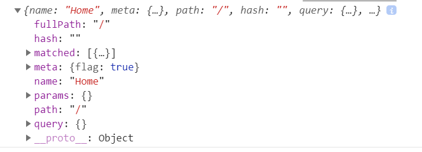
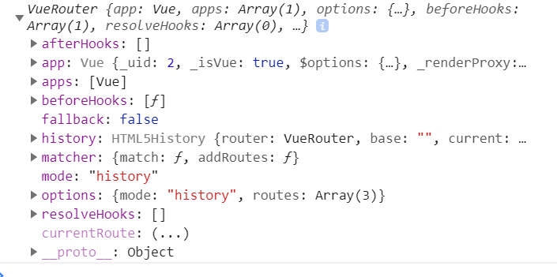

# 1. 路由的基础配置
## 1.1 router.js 中
```javascript
//1.基础配置
import Vue from 'vue'
import Router from 'vue-router'
// 使用路由
Vue.use(Router)

//2.导入组件并配置路由
import Home from './views/Home.vue'
routes: [
    {
      path: '/',//路由路径
      name: 'home',//路由的名字
      component: Home//组件
    },
    {
      path: '/about',
      name: 'about',
      component: function () { //便于懒加载
        return import('./views/About.vue')
      }
    }
  ]

// 3. 导出路由相关信息
// router.js中
export default new Router({
    // 路由相关信息
})

// main.js 中
import router from './router';
new Vue({
  router,//使用路由
  render: function (h) { return h(App) }
}).$mount('#app')
```
## 1.2 在组件中(比如APP.vue)使用路由
```html
<template>
  <div id="app">
    <div id="nav">
      <!-- router-link中的tag表示被渲染为什么标签 -->
      <router-link  tag="a" to="/">Home</router-link> |
       <router-link to="/about">About</router-link>
    </div>
    <router-view/>
  </div>
</template>
```
## 1.2- 路由使用的一些细节补充
### 1.2-1 router-link 与 router-view 标签
```html
<div id="app">
  <h1>Hello App!</h1>
  <p>
    <!-- 使用 router-link 组件来导航. -->
    <!-- 通过传入 `to` 属性指定链接. -->
    <!-- <router-link> 默认会被渲染成一个 `<a>` 标签 -->
    <router-link to="/foo">Go to Foo</router-link>
    <router-link to="/bar">Go to Bar</router-link>
  </p>
  <!-- 路由出口 -->
  <!-- 路由匹配到的组件将渲染在这里 -->
  <router-view></router-view>
</div>
```
### 1.2-2 router-link中的 to 和 tag 属性
#### to
to 就是要跳转到哪里，是必须的属性，其有三种形式
```javascript
to = '/Home'           //路径(字符串格式)
:to = {path:'/Home'}   //路径(对象格式),要注意数据绑定 :to
:to = {name:'home'}    //名字(对象格式),要注意数据绑定 :to
```

### 1.2-3 router-link-exact-active 与 router-link-active


- router-link-exact-active 是完全匹配路径，当某个路由被点击了，就会有上面这个类名，只包括本身，不包括其父级路径。
- router-link-active 包含此路径的路由都会具有这个类名
/     
/aaa     
/aaa/bbb      
比如上面这三个路径，都会有router-link-active类名

如果嫌弃这个名字长，可以打开路由的配置文件(router.js)对其进行配置
```javascript
{
  linkExactActiveClass:'exact',
  linkActiveClass:'active'
}
```
、


### 1.2-4 redirect 重定向
在某个路由下面设置此属性，当进入到该 '/question' 路径时，就会重定向到redirect 所指向的路径 '/question/test1'

```javascript
// router.js 中
  {
      path:'/question',
      component:()=>import('./components/Question'),
      redirect:'/question/test1'
  }
```

当访问不存在的路径时，返回网页不存在的界面，也可以用redirect处理，其值除了可以是字符串以外，还可以是一个函数，接受一个 to 参数，包含要去到的页面的信息。 * 代表上面所有的路径都没有被匹配上的时候，才会走此路由配置的路径相关信息

```javascript
// router.js 中
  {
      path:'*',
      redirect(to){
        if(to.path === '/'){
          // 如果去的是根路径，就重新定向到'/home'
          return '/home'
        }else{
          // 如果访问的路径不存在，就重新定向到不存在的页面
          return '/NotFound'
        }
      }
  }
```


# 2. 路由的属性 $route



## 2.1 meta 路由元信息

```javascript
// router.js中
 routes:[
    {
      path:'/',
      name:'Home',
      component:Home,
      //路由元信息
      meta:{
        flag:true
      },
      // 配合导航守卫进行使用
      // 比如，当flag为真的时候，才可以进入相关路由
      // 这个导航守卫不一定写在这个路由所在的地方
      beforeEnter(to,from,next){
        console.log(to.meta)
        next();
      }
    }
 ]
```

## 2.2 matched

```javascript
beforeEnter(to,from,next){
        console.log(to.matched)//是一个数组，
        //会将自己及所有的祖宗路径都放到这个数组里面
        // 3. a/b/c
        // 2. a/b
        // 1. a
        // 通过查看数组中的每一项的meta属性中是否有相应的元信息进行相应的操作
        next();
      }
```

# 3. 路由的方法 $router

## 3.1 路由跳转相关方法(编程式导航)
在 $router 的原型上，有push，replace,go三种方法可以进行跳转。
```html
<!-- 使用如下： -->
<li @click="pushDemo">push跳转</li>
```
```javascript
//使用如下：
pushDemo(){
  this.$router.push('/');
}
```
### 3.1.1 push 和 Place
```javascript
//该方法的参数可以是一个字符串路径，或者一个描述地址的对象。例如：

// 字符串
router.push('home')

// 对象
router.push({ path: 'home' })

// 命名的路由
router.push({ name: 'user', params: { userId: '123' }})

// 带查询参数，变成 /register?plan=private
router.push({ path: 'register', query: { plan: 'private' }})
//注意：如果提供了 path，params 会被忽略，上述例子中的 query 并不属于这种情况。取而代之的是下面例子的做法，你需要提供路由的 name 或手写完整的带有参数的 path：

const userId = '123'
router.push({ name: 'user', params: { userId }}) // -> /user/123
router.push({ path: `/user/${userId}` }) // -> /user/123
// 这里的 params 不生效
router.push({ path: '/user', params: { userId }}) // -> /user
同样的规则也适用于 router-link 组件的 to 属性。
```

replace 跟 router.push 很像，唯一的不同就是，它不会向 history 添加新记录，而是跟它的方法名一样 —— 替换掉当前的 history 记录。

[a,b,c,d]---->[a,b,c,d,e]     push            
[a,b,c,d]---->[a,b,c,e]       replace
### 3.1.2 go
```javascript
//这个方法的参数是一个整数，意思是在 history 记录中向前或者后退多少步，类似 window.history.go(n)。

例子

// 在浏览器记录中前进一步，等同于 history.forward()
router.go(1)

// 后退一步记录，等同于 history.back()
router.go(-1)

// 前进 3 步记录
router.go(3)

// 如果 history 记录不够用，那就默默地失败呗
router.go(-100)
router.go(100)

```


# 4. 动态路由
```javascript
// router.js 中
routes:[
      {
      path:'/question/:id',
      name:'question',
      component:()=>import('./components/Question')
    }
]
```
```html
<!-- xxx.vue 组件中 -->
<template>
    <div>
        <h1>demoTest1</h1>
        <router-link
        <!-- params 中的id 取决于路由元信息中写了什么属性（此处是id） -->
        <!-- 这里的params.id  的值是什么，对应的路由就是什么
        比如此处：xxx/question/2018 -->
        :to="{name:'question',params:{id:item.id}}"
        v-for="(item,index) in content"
        :key="index"
        > {{ item.name }} </router-link>
    </div>
</template>
```

```javascript
// 可通过js拿到id的值
this.$route.params.xxx
```

# 5. 导航守卫
先执行全局守卫，再执行路由独享守卫，在执行组件内守卫

## 5.1  组件内守卫(在组件中进行使用)
```javascript
export default {
  name: 'home',
  beforeRouteLeave(to,from,next){
     next();
      },
  data(){
    return {
      content:null
    }
  },
}
```
当某个路由使用了 设置了守卫的组件， 那么这个路由就将会被守卫

beforeRouteLeave 是指从使用了  设置了守卫的组件  跳转到了一个没有使用该组件的路由，如果跳转的新的路由也使用了这个组件，那么这个函数就不会执行(但是此种情况下beforeRouteUpdate 就会执行,貌似也只在此种情况下执行)

```javascript
// 导航守卫函数中的next 执行了，才能进入相应的路由
beforeRouteLeave(to,from,next){ next(); }
beforeRouteEntet(to,from,next){ next(); }  可以配合生命周期函数 mounted 进行使用  

在该守卫中不能使用this，但是可以在next()函数里传参进行使用：
```javascript
beforeRouteEntet(to,from,next){ next( (vm)=>{
  console.log(vm)
});} 
```

beforeRouteUpdate(to,from,next){ next(); }


##  5.2 路由独享守卫(在路由中使用(router.js中))
```javascript
 routes:[
    {
      path:'/',
      name:'Home',
      component:Home,
      meta:{
        flag:true
      },
      beforeEnter(to,from,next){
        console.log(to)
        next();
      }
    }
 ]
```
## 5.3 全局守卫(在 main.js 中进行使用)


```javascript
// console.log(App);//引入的app组件是一个对象
// 全局守卫
router.beforeEach((to,from,next)=>{
  next();
})
// 路由内的东西全部被解析完毕之后才会去执行
// 一层层加载直到加载到组件也加载完成的时候就会执行
// router.beforeResolve((to,from,next)=>{
//   next();
// })

// 路由都加载完成后
// 没有实际性的作用，所以没有参数
// router.afterEach(()=>{

// })
```