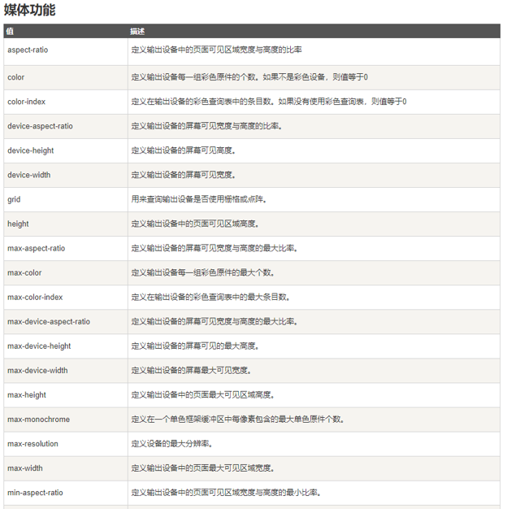

# 响应式网页设计
响应式网页设计或称自适应网页设计或称回应式网页设计/对应式网页设计，是一种网页设计的技术做法，该设计可使网站在**不同的设备**（从桌面计算机显示器到移动电话或其他移动产品设备）上浏览时**对应不同分辨率皆有适合的呈现**，减少用户进行缩放，平移和滚动等操作行为。**用一套代码解决几乎所有设备的页面展示问题。**
***
真正的响应式设计方法不仅仅是根据可视区域大小而改变网页布局，而是要从整体上颠覆当前网页的设计方法，是针对任意设备的网页内容进行完美布局的一种显示机制。


# meta标签(用来适配各种设备)
将页面大小，根据分辨率不同进行相应的转化。css像素根据设备像素进行计算，适配不同分辨率的设备   
```html
<meta name="viewport" content="width=device-width,minimum-scale=1.0,maximum-scale=1.0,user-scalable=no">


```
## 1. content属性
content中的width是设置视口的宽度，可手动设置：content = 500px;
### **content="device-width"**
device-width是设备宽度，视口宽度等于设备宽度
### **initial-scale=1.0**
initial-scale=1.0指缩放比为1，也就是不缩放，其等于content="device-width"，标签上写两者就是为了实现兼容性
### **user-scalable**
设置是否允许用户进行缩放
# 响应式网页开发方法
响应式网页开发主要是在css样式上面进行操作
## 1. 流体网格
可伸缩的网格 （大小宽高  都是可伸缩（可用flex或者百分比来控制大小）float）---》 布局上面 元素大小不固定可伸缩
## 2. 弹性图片
图片宽高不固定（可设置min-width: 100%）
## 3. 媒体查询(最常用的)
- 媒体查询是向不同设备提供不同样式的一种方式，它为每种类型的用户提供了最佳的体验。
- 让网页在不同的终端上面展示效果相同（用户体验相同让用户用着更爽） ；在不同的设备（大小不同 分辨率不同）上面均展示合适的页面
### **媒体类型**

### **媒体特性(功能)**
使用的时候要注意加"( )",比如：    
```html
    <link rel="stylesheet" media="(max-width:375px)" href="./index.css">
```



### **如何使用媒体查询**
1. link标签   
当屏幕像素小于375px再进行展示   
**媒体类型和媒体特性之间用and来连接**
```html
    <link rel="stylesheet" media="screen and (max-width:375px)" href="./index.css">
```
2. @import 'index.css' screen and (max-width:375px)
3. css文件   
**要注意媒体查询不占用权重！一般css引入的时候把媒体查询放到最下面**
```css
div{
    width:100px;
    height:100px;
    border:1px solid black;
}
@media (max-width:350px){
    body{
        background-color:blue;
    }
    div{
        height:30px;
        width:40px;
    }
}
```
## 4. 主要断点： 设备宽度的临界点 
大小的区别 --> 宽度不同   --> 根据不同宽度展示不同的样式


# 属性辨析
## width/height与device-width/height

device-width/device-height是设备的宽度（如电脑手机的宽度 不是浏览器的宽度）;

width/height使用documentElement.clientWidth/Height即viewport(视口)的值。渲染宽度/高度/视口宽度/
## 单位值
### rem(root em)
相对于根标签的font-size值
```css
html{
    font-size: 10px
}
div{
    height: 5rem;
    /* 这里的height的真实像素为 5 * 10 px = 50 px */
    width:10rem;
    background-color: aquamarine;
}
```
**rem作用**    
结合媒体查询来用，当切换到不同的设备上，只需更改font-size的值就可以了
### em
相对于本身的font-size值,要注意font-size属性是可以继承的
```css

div{
    font-size:5px;
    height: 5em;
    /* 这里的height的真实像素为 5 * 5 px = 25 px */
    width:10em;
    background-color: aquamarine;
}
```
### px
相对于显示器分辨率
### vw和vh(一般会用在移动端开发里面)
vw：相对于视口的宽度。视口被均分为100单位的vw
vh：相对于视口的高度。视口被均分为100单位的vh

```css

div{
    height: 5em;
    width:50vw;
    /* 这里的width相当于视口而不是设备的一半 */
    background-color: aquamarine;
}
```

### vmax
查看视口的宽高，取最大的一边分为100份；
### vmin
查看视口的宽高，取最小的一边分为100份；
## 渐进增强(向上兼容)
iphone6 向上兼容  兼容最新设备   
## 优雅降级(向下兼容)
开发通用版本  再兼容老版本   向下兼容
