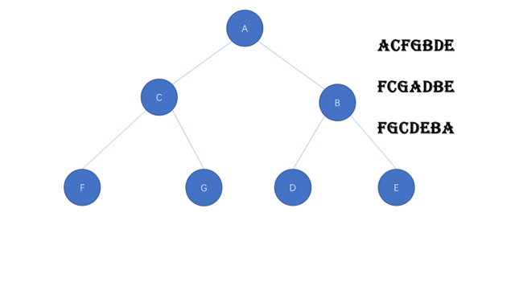

# 二叉树的构建



```javascript
function Node (value){
    this.value = value;
    this.left = null;
    this.right = null;
}

var a = new Node("a");
var b = new Node("b");
var c = new Node("c");
var d = new Node("d");
var e = new Node("e");
var f = new Node("f");
var g = new Node("g");

a.left = c;
a.right = b;
c.left = f;
c.right = g;
b.left = d;
b.right = e;
```

# 二叉树的前序遍历

```javascript
function each(root){
    if(root == null) return;
    console.log(root.value);
    each(root.left);
    each(root.right);
}
```

# 二叉树的中序遍历

```javascript
function each(root){
    if(root == null) return;
    each(root.left);
    console.log(root.value);
    each(root.right);
}

```
# 二叉树的后续遍历
```javascript
function each(root){
    if(root == null) return;
    each(root.left);
    each(root.right);
    console.log(root.value);
}
```

# 试题
ACFGBDE
FCGADBE
FGCDEBA
## 给出二叉树的中序和前序遍历，写出后续遍历

ACFGBDE
FCGADBE

解题步骤：
1. 根据前序遍历，找到根节点
前序遍历的第一个数就是根节点

ACFGBDE----A

2. 根据中序遍历，分开左右子树
                A
FCGADBE--->FCG    BDE

3. 根据前序遍历找到子树的根节点

子树的前序遍历的第一个节点就是根节点

A   CFG    BDE
     C       B


     A
C          B


4. 根据中序遍历，写出子树根节点的子节点
FCG   A   DBE    
                    A

            C                B

        F       G         D          E
```javascript
var qianList = ['a','c','f','g','b','d','e'];
var zhongList = ['f','c','g','a','d','b','e'];

function demo(qian,zhong){
    if(qian == null || zhong == null || qian.length == 0 || zhong.length == 0 || qian.length != zhong.length) return;
    // 找到根节点
    var root = new Node(qian[0]);
    // 区分左右子树
    var index = zhong.indexOf(root.value);
    var qianLeft = qian.slice(1,1 + index);
    var qianRight = qian.slice(1+ index,qian.length);
    var zhongLeft = zhong.slice(0,index);
    var zhongRight = zhong.slice(index + 1,zhong.length);
    root.left = demo(qianLeft,zhongLeft);
    root.right = demo(qianRight,zhongRight);
    return root;
}
```

## 根据中序和后续遍历，找出前序遍历

其过程和上面那个题差不多，只不过是根据后续遍历来找寻根节点而已

FCG    A    DBE
FGC    DEB         A

root      left      right
A           C           B
B           D           E
C           F           G

# 二叉树的深度优先搜索的代码实现

```javascript
// 对于二叉树来说，二叉树的深度优先搜索与前序遍历顺序是一样的，
// 
 function Node(value){
    this.value = value;
    this.left = null;
    this.right = null;
 }

 var a = new Node('a');
 var b = new Node('b');
 var c = new Node('c');
 var d = new Node('d');
 var e = new Node('e');
 var f = new Node('f');
 var g = new Node('g');

 a.left = c;
 a.right = b;

 c.left = f;
 c.right = g;

 b.left = d;
 b.right = e;

 function deepSearch(root,target){
    if(root == null) return false;
    if(root.value == target) return true;
    var left = deepSearch(root.left,target);
    var right = deepSearch(root.right,target)
    return left || right;
 }

console.log( deepSearch(a,'f'))
```

# 二叉树的广度优先搜索的代码实现

```javascript
 function Node(value){
    this.value = value;
    this.left = null;
    this.right = null;
 }

 var a = new Node('a');
 var b = new Node('b');
 var c = new Node('c');
 var d = new Node('d');
 var e = new Node('e');
 var f = new Node('f');
 var g = new Node('g');

 a.left = c;
 a.right = b;

 c.left = f;
 c.right = g;

 b.left = d;
 b.right = e;

 function wideSearch(rootList,target){
    if(rootList == null || rootList.length == 0) return false;
    var childList = [];
    
    for(var i = 0;i < rootList.length;i++){
        console.log(rootList[i].value)
        if(rootList[i] != null && rootList[i].value == target){
            return true;
        }else{
            childList.push(rootList[i].left);
            childList.push(rootList[i].right)
        }
    }
    return wideSearch(childList,target)
 }

console.log( wideSearch([a],'e'))
```

# 二叉树的比较
## 判断两颗二叉树是否相同
```javascript
    
```