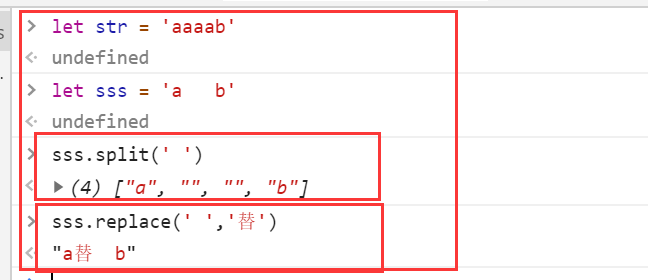

# 题目
请实现一个函数，将一个字符串中的每个空格替换成“%20”。例如，当字符串为We Are Happy.则经过替换之后的字符串为We%20Are%20Happy。

## 解法
```javascript
function replaceSpace(str)
{
    // write code here
    return str.split(' ').join('%20')
}
```

## 收获
- 要注意replace的替换，只能替换一个空格
- 使用split拆分可以识别到多个空格(本题目测试中放置了三个空格(共五个字符，拆分后成为了4个))

