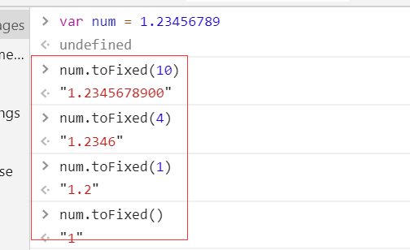

# 1.toFixed( num )
简单说来，这个的用法就是，保留小数点后多少位，不够的补上0；位数的值为【0，20】，如果不填参数默认值为 0 ；
## 1.1 基础知识
toFixed() 方法可把 Number 四舍五入为指定小数位数的数字。   

NumberObject.toFixed(num)

num	必需。规定小数的位数，是 0 ~ 20 之间的值，包括 0 和 20，有些实现可以支持更大的数值范围。如果省略了该参数，将用 0 代替。

返回 NumberObject 的字符串表示，不采用指数计数法，小数点后有固定的 num 位数字。如果必要，该数字会被舍入，也可以用 0 补足，以便它达到指定的长度。如果 num 大于 le+21，则该方法只调用 NumberObject.toString()，返回采用指数计数法表示的字符串。

当 num 太小或太大时抛出异常 RangeError。0 ~ 20 之间的值不会引发该异常。有些实现支持更大范围或更小范围内的值。

当调用该方法的对象不是 Number 时抛出 TypeError 异常。
## 1.2 使用

