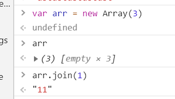

# 请写出一个方法 repeat ,使一个字符串重复自身N次
## 方法一
创建空数组,用传进来的字符串进行连接,相关原理如下图


```javascript
function repeat(str,num){
    return new Array(num + 1).join(str)
}
```
## 方法二
```javascript
function repeat(str,num){
    var count = 0;
    var temp = str;
    do{
        str += temp;
        count ++;
    }while(count < num);
    return str;

```
